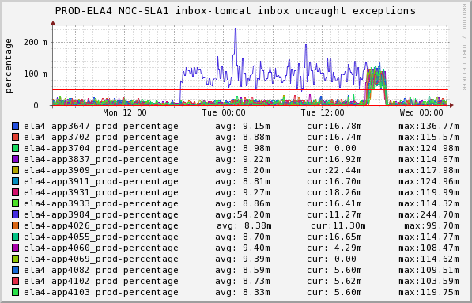
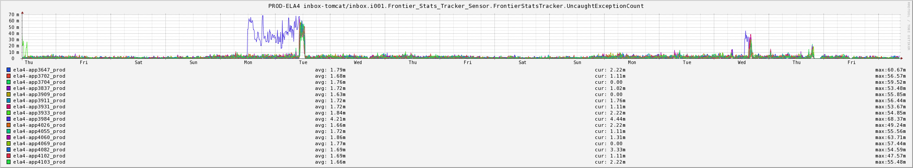

+++
title = "(Not) Learning from Mistakes"
date = "2016-01-07"
slug = "not-learning-from-mistakes"
draft = false
+++

*[This is the first in a weekly series of posts about interesting inGraphs I've stumbled across in my time as an SRE at LinkedIn]*

One of the things I love about inGraphs is how it can tell a story if you know how to look. Sometimes that story is one of victory, sometimes it's one of sorrow and woe. Comedy, tragedy, drama...to co-opt a familiar saying, an inGraph is worth 1000 words. Here's one of my favorite examples:

This is a screenshot of an inGraph representing uncaught exceptions being thrown by inbox-tomcat. A little background on how code gets rolled out to production at LinkedIn: after going through testing in the integration environment we typically deploy a given build to a single machine in each production fabric (the "canary") and let it run on that node for some amount of time. We do this in order to build confidence about how the code is going to perform in production while minimizing impact if it happens to be broken. If the canary looks fine then (we hope) the full deployment will be fine as well; we "promote" the canary - roll that build out to all of production. If it does **not** look fine then we can roll it back relatively quickly.

Take a close look at the above graph. Note how one machine starts throwing more uncaught exceptions than the rest of them. That would be the canary. Now...look at how **all** of the machines start throwing more exceptions. The sharp reader will have guessed it by now: that would be the canary promotion. This is an example of how you do **not** want your deployments to look. I've long since forgotten the details, but there was a bug in the code. It should have been caught in canary, rolled back, and fixed.

...but that's not the end of the story. Take a look at this:

This is an inGraph of the same metric on a slightly different timeline and scale. The perturbations toward the left are the same as the first inGraph I showed you. The ones toward the right? <sigh> Yeah...the same **exact** thing happened the following Wednesday. A busted canary was deployed, the increase in uncaughts was ignored/overlooked, and the damn thing was promoted **again**. Again, I don't recall the details so I don't recall whether it was the same build or a different build in which we thought the bug was fixed but that's kind of beside the point, which is this: always look at your canary metrics or you may be promoting broken code to production.
