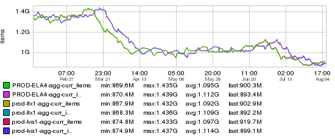

+++
title = "Less is More"
date = "2016-01-14"
slug = "less-is-more"
draft = false
+++

[I ripped off this post's title from a post that Aatif Awan did last July about how ](http://cinco.corp.linkedin.com/profile/show?id=3997)[LinkedIn will be sending its members less email. This post really resonated ](http://blog.linkedin.com/2015/07/27/less-email-from-linkedin/) with people ([including Jimmy Fallon). It resonated with me in particular for a handful of reasons; here are two of them:](http://www.nbc.com/the-tonight-show/video/linkedin-cuts-down-on-emails-walking-dead-beer-monologue/2887441)

1. I'm tired of telling people where I work and getting the question "Why do you guys send me so damn many emails?", and

2. It resulted in the cool graph below.

This graph is an indirect representation of the reduction in email sends from January through August of 2015. I say "indirect" because the metric being shown is **not** actually send volume. So, what is it? Well, it's the number of items in a couchbase bucket being used as the source of truth for email deduplication.

You see, stork - the infrastructure LinkedIn uses for rendering and sending emails - provides a deduplication API to its clients. It's the responsibility of the client to provide a sufficiently-unique key to stork for each request to send an email. Before sending, stork checks the couchbase bucket I mentioned before to see whether that key already exists. If it exists, stork drops the email assuming it is a duplicate. If it does **not** exist, stork inserts the key and goes ahead with sending the email.

So...if we send 1.4B emails in a week then there will be 1.4B items in this couchbase bucket. These items have a 7-day Time-to-Live (TTL); that is, after 7 days they are "expired" and removed from the bucket. Over time if there are increases/decreases in sends they will show up here (with ~7 days' lag).

Aatif's claim was "**For every 10 emails we used to send, we’ve removed 4 of them."** Well, let's take a look..."Trust, but Verify", eh? Picking a fabric, the graph maxes out at 1.435B dedupe records (March-ish timeframe) and shows a minimum of 869.6M dedupe records right around the time Aatif posted.

Divide that out and you get 0.606. I'd say he got pretty close.
