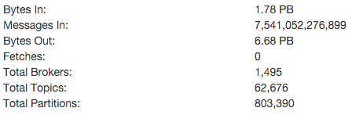
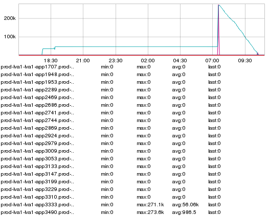

+++
title = "Failure Modes (Kafka Client Edition)"
date = "2016-01-22"
slug = "failure-modes-kafka-client-edition"
draft = false
+++

[*[Note: There is how a go link for the inGraph of the Week! go/igotw*](http://go.corp.linkedin.com/igotw)*]*

This week's iGotW describes an interesting failure mode of a piece of technology that is heavily leveraged by LinkedIn: the kafka consumer client. Before getting too deep into the details I want to spend a moment talking about how awesome kafka is - partly because it is, in fact, awesome, and partly because quite literally every service I support uses it in some way and I would prefer to stay in the good graces of the world-class SREs and SWEs who support it.

[To get some idea of the scale on which kafka operates at LinkedIn, let's have a look at some summary statistics from last week:](https://sre.corp.linkedin.com/apps/reflection/summary/lastweek)

Your eyes do not deceive you. 1.78 **petabytes** inbound traffic, 6.68 **petabytes** traffic out, 7.5 **trillion** messages received. If you've touched a service at LinkedIn you've touched kafka; we use it for everything from metric collection to log aggregation to asynchronous message passing between services. In terms of throughput I'd wager it's the single largest piece of technology we use in our online systems. I would **also** wager it's the single most reliable piece of technology we employ. Challenge: If you can come up with anything more reliable via any meaningful metric - outages per petabyte, errors per message /QPS, etc. - I would **love** to hear about it in the comments (and see a graph backing it up).

All of that said, here is the inGraph of interest:

I've clipped out a lot of detail, so this graph bears a bit of explanation. Kafka has the concept of a "Topic". These topics are divided into  partitions. When *n* a consumer starts up it is allotted zero or more partitions from which to read (consume) messages and process them. A really cool feature of the LinkedIn kafka client is that it automatically rebalances consumption of partitions. It's outside the scope of this post to describe how rebalances work in detail, but generally-speaking if a consumer shuts down its partition(s) will be automatically rebalanced among the other consumers and consumption/processing will continue.

This is a graph emitted by the consumer known as MaxLag. It represents the maximum number of messages outstanding in the partition(s) from which it is consuming before it is "current". If the consumer is keeping up with the messages being put into the queue then the MaxLag will stay at (or near) zero. If it is not then this metric will start to climb, which can be an indicator that something has gone wrong - perhaps the thing writing (the Producer, in kafka parlance) has unevenly distributed messages to a partition, or the consumer is falling behind, or something else Bad is going on. Generally speaking if MaxLag is going to climb it will do so gradually as a consumer falls behind...but we see something a little more interesting here. MaxLag flatlines at a certain level, temporarily spikes up (on a different host), and then slowly "drains off".

Without further ado, let's talk about how this played out:

1. Something occurred which caused the consumer to stop consuming.

2. The automatic rebalance mechanism either did not kick in **or** did kick in but failed silently, resulting in the failing consumer maintaining ownership of its partition(s).

3. The consumer is no longer consuming, but (this is the gnarly bit) **continued to emit the last known metric for MaxLag**. This effectively makes this particular type of failure **really** difficult to detect.

4. The service is manually restarted, killing off the wedged consumer and kicking off a rebalance.

5. The partition is temporarily rebalanced to another consumer, which correctly assesses MaxLag - i.e., the consumer suddenly "realizes" (in terms of metrics emission) that there are a ton of messages to be consumed.

6.

6. The original consumer completes its restart, a final rebalance happens, and the original consumer finishes out consuming messages until MaxLag goes back to zero.

The circumstances that caused this boiled down to garbage collection pauses that can cause the consumer to - for lack of better terminology - Lose Its Mind. It doesn't happen on every long GC pause. It may even require multiple pauses in a row to reproduce this same sort of decidedly pathological failure scenario. I suppose my primary takeaway is this: "The things that are going to fail are going to fail (in interesting ways) at scale."
