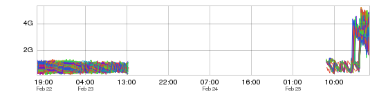
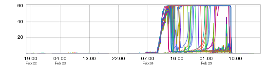
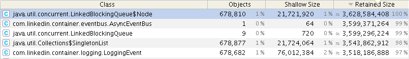

+++
title = "Where Did the Metrics Go?"
date = "2016-01-28"
slug = "where-did-the-metrics-go"
draft = false
+++

Sometimes the most interesting thing about a metric can be its absence. Take a look at this:

I don't have screenshots of all of the metrics that went missing for this particular service over this time period but they're not necessary; they **all** fell off the map. Every metric this service was emitting just ceased to exist. The point of at which the metrics disappeared coincided with a deployment of the service, but at the time we didn't really know why. This was awful - we were flying blind - but the service still seemed to be doing what it was supposed to be doing based on testing and looking at logs.

Now let's take a look at some data points being collected that did not depend upon metrics emitted by the service itself:

This one requires a bit of explanation. This is a graph of a metric known as stall time. It is collected via a script that parses the garbage collection (GC) log of a service. It represents the number of seconds that the service spent in GC on a one-minute interval. See that plateau? This service was spending 60 seconds out of every minute pausing for garbage collection. I tried to align the timeframes as best I could, so it's (hopefully) apparent via visual inspection that after about a day of not emitting metrics this service went berserk with GC. Oh, and BTW - once GC went through the roof the service was so busy collecting garbage that it stopped writing logs.

Things were bad. My engineer developing the service came to me asking "Why isn't it working?" It wasn't emitting metrics and it wasn't writing logs...I think my response was something like "What, am I a wizard?"

So what happened here? What caused this service to lose its mind?

Well, sometimes a heap dump and a profiler can help. I honestly didn't hope to get a heap dump - when your JVM runs out of memory it's a crapshoot as to whether you can get it to do anything useful at all - but in this case we actually got lucky:

We got a full heap dump out of it in spite of the ridiculous amount of GC going on and it showed something interesting which made it all come together: the **entirety** of the heap appeared to be taken up by a backing queue for metric events - a queue without limitations, which would continue to buffer metric events indefinitely if metrics could not be emitted (until it blew through the entire heap).

I don't recall the specifics of **why** metrics could not be emitted - I think it had something to do with an avro schema mismatch - but the lesson here is this: if there is a deploy that breaks metric/log emission, roll it back. It doesn't matter whether it "seems to be working" - if you cannot measure what it's doing then you're probably better off having it not do anything at all.

