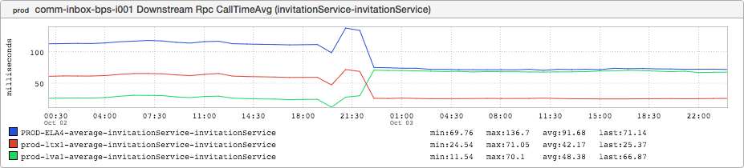

+++
title = "Mystery Edition"
date = "2016-02-04"
slug = "mystery-edition"
draft = false
+++

In lieu of the normal Thursday post I thought I'd try something a little different this week - perhaps a bit of a challenge. Take a look a this:

What's going on in this graph? I'll talk more about it on Thursday, but in the mean time I'd like to hear any discussion/guesses/conjecture in the comments about what you think it might be. Feel free to ask for additional details; I'll provide what I can so long as those hints don't give it away entirely. Along those lines: If you already know for certain what's going on here or I've already shown you this graph feel free to ping me via slack/email, but please don't spoil

the fun.

***Update:*** As I mentioned in the comments, most of the guesses as to what this graph represents boiled down to "something to do with a traffic shift". This is *super* close, but not quite 100% correct. There are also a handful of folks who knew what it was outright; kudos (you know who you are). :-)

So what's actually going on here?

This graph can be thought of as a basic demonstration of the [speed of electricity](https://en.wikipedia.org/wiki/Speed_of_electricity) and, by extension, the speed of light (c). In a vaccuum electromagnetic waves propagate at the speed of light. Through a cable they propagate at an [appreciable fraction](https://en.wikipedia.org/wiki/Velocity_factor#Typical_velocity_factors) of that - say, 0.5c to 0.9c. This is Very Fast, to be sure... but not infinitely fast. "But what does that have to do with this inGraph?" you ask. I'm getting there.

This is an inGraph showing the latency of calls being made from comm-inbox-bps to invitations in the 3 production data centers we had at the time I took the screenshot. What's key to note here: invitations is a single master service. On the lefthand side of the graph invitations was mastered in lva1 - our Virginia data center. Calls being made in lva1 were low-latency because they were physically close to where invitations was mastered; i.e., the latency is dominated by the amount of time the service spends actually processing the request. Calls from our Texas data center (ltx1) took a little longer by virtue of having to travel halfway across the country, and calls from our LA data center (ela4) took longer still as they had to travel all the way to the west coast.

The point of inflection in the middle? That is the **Single Master Failover (SMFO)** that took place last October, when a whole pile of LinkedIn engineers thought it might be fun to get together on a Friday night and migrate every single master service to ltx1. After that, calls in ltx1 "got fast" and calls from lva1 and ela4 - which are roughly equidistant from Texas - split the difference and settled in on nearly identical average latencies.
