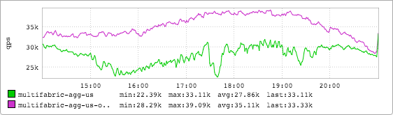
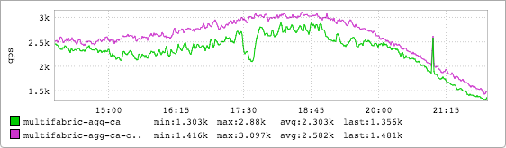

+++
title = "The Superbowl"
date = "2016-02-11"
slug = "the-superbowl"
draft = false
+++

While inGraphs give us insight into how our services are doing operationally, they can also show us what's going on in the external world. Nights & weekends, holidays, major sporting events - all of these things can have an impact on site traffic and thus on site metrics. Even meal times can be seen, in some cases; in a future post I might compare how seriously the people in different countries take their lunch. (My money's on the French, but I have insider information...)

At any rate, since it was just last weekend the specific event I want to talk about here is the Superbowl. The inGraph below is US site traffic during last year's Superbowl:

There it is, in all its glory. The traffic drop as the game starts, the sudden surge in traffic when halftime starts and everyone gets up to go to the bathroom, the plummet when everyone decides to take notice of Left Shark, the fourth quarter rally by the Patriots...I'll bet Russell Wilson's goal line interception is in there somewhere, I just can't quite pinpoint it.

How does that compare to this year?

The traffic drop is obvious but not *quite* as striking - the week-over-week numbers are skewed for reasons other than the game. Also, this may have been the most boring Superbowl ever played. Halftime was still popular, though, and it looks like some folks tuned in to see the end of the game. Here's another thing that caught my eye this year:

This is the site traffic graph for Canada. Yep, they watched the game - particularly the halftime show. Apparently Canadian LinkedIn members like

Coldplay just as much as US members.
