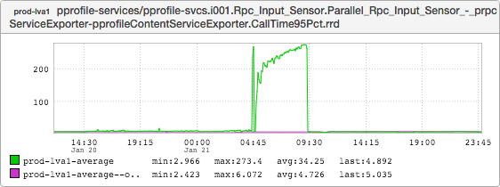
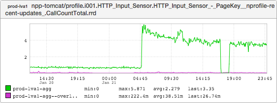
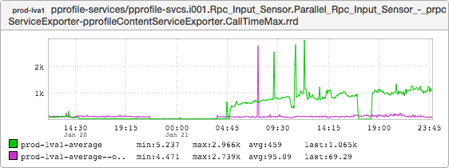
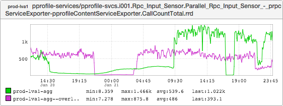

+++
title = "Lies, Damned Lies, and Statistics"
date = "2016-02-18"
slug = "lies-damned-lies-and-statistics"
draft = false
+++

This week I'd like to share a story about how metrics can lie to you. Take a look at this:

This is the graph of the 95th percentile (p95) latency for pprofile-services. (If you're unfamiliar with how percentiles work or why they might be useful feel [free to either read up or ask me ](https://en.wikipedia.org/wiki/Percentile)[directly.) The course of events was something like this:](mailto:csnyder@linkedin.com)

1. A sudden drastic uptick in p95 latency set off alerts around 04:45, triggering an escalation to SRE

2. SRE investigated, found a possible culprit - a lix that had been enabled the previous afternoon - and terminated it in order to rule it out as the cause

3. More or less immediately upon termination, p95 latencies dropped to previous levels

Problem Solved, right? ...but why this lix? ...and why didn't it manifest itself until many hours after it had been activated?

Well, the answers to these questions require a bit of context about what the lix was and how this call pattern works. The lix was for ramping public profile traffic from an older service (npp-tomcat) to a new & improved implementation (appropriately named public-profile-frontend). The ramp was from 50% to 100%...sort of; the ramp left behind a very small amount of traffic to npp-tomcat - functionality that hadn't yet been implemented in the New Hotness.

Another piece of the puzzle is the queries per second (QPS) to the particular bit of functionality that was left behind:

Some more context: the main purpose in terms of site traffic to public profiles is search engine optimization (SEO). This type of call pattern is very typical for SEO-related services. Google/Yahoo/Bing bots will lie dormant for days or weeks at a time, spin up suddenly and start hammering a service for some period of time, and then just as suddenly stop. Also important to note: npp-tomcat makes calls to pprofile-services for most (all?) of the qps that it receives.

At any rate, the start time aligns nicely with our latency increase. But the traffic continued after the lix was terminated around 09:30. So what's going on here?

Well, check this out:

This graph represents the **maximum** latency for calls to pprofile-services. Note that it didn't budge when the lix was terminated at 09:30, either.

The savvy reader who has seen something like this before may know what's going on. Let's lay it out explicitly:

1. The majority of incoming traffic to npp-tomcat (and thus pprofile-services) was ramped to public-profile-frontend, leaving behind a small amount of intermittent but relatively high-latency traffic.

2. Some hours later a search engine bot started sending traffic to that high-latency endpoint, causing an immediately noticeable spike in p95 latency.

3. After investigation the ramp was terminated, increasing the amount of calls to npp-tomcat (and thus pprofile-services).

4. ***(The Crucial Bit)*** *Which then "pushed" the high-latency calls* ***out*** *of the 95th percentile due to the increased traffic!*

The latency for those calls never got better - it was (and remains) super high-latency. It just "disappeared" from the p95 metrics by virtue of the volume of lower-latency traffic once the lix was terminated.

Another way of describing it:

When you're only doing a few hundred QPS, 4 QPS' worth of latency will probably show up in your metrics. Now suppose you jump to well over 1000 QPS. Well, maybe that one low-QPS, high-latency call won't even register...
