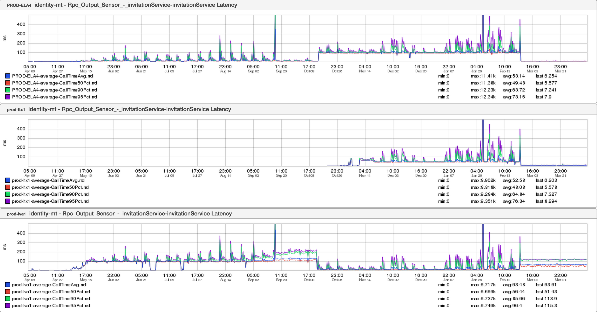

+++
title = "Tradeoffs"
date = "2016-02-25"
slug = "tradeoffs"
draft = false
+++

In this week's post I'd like to focus on an example of something every engineer should be familiar with: tradeoffs.

This is a screenshot I took of some inGraphs from early 2015. The metric being represented is latency from identity-mt to invitations. It's a 12-month timeline of Ancient History so there is a bunch of stuff going on here (I actually named the snapshot "wow_lots_of_things"). Take some time to digest it - it's a pile of information - and then we'll break down some of the more interesting bits.

The points of inflection:

April/May 2014 - traffic starts coming into lva1 October 2014 - Single Master Failover (SMFO); all single-master services are migrated from ela4 to lva1 October/November 2014 - we turn on the lights in ltx1 February 2015 - The Tradeoff

What happened in February 2015? invitations is a single-master service and at the time it was mastered in lva1. As the graphs show, latencies got better in ela4 and ltx1 but they actually got *worse* in lva1. Why did that happen?

Well, for read-only use cases it made sense to have calls to invitations go to the "local" colo in order to avoid the latency penalty for making a call to a service that wasn't geographically close. That's why latency went down in ela4 and ltx1 - they no longer had to make long-distance calls. Unfortunately latencies for calls to invitations in the master fabric (lva1, at the time) end up being roughly proportional to the amount of incoming write traffic; that is to say, latencies tend to spike for the master fabric during peak traffic. So here's what we did:

we pointed ela4->ela4 we pointed ltx1->ltx1 **we pointed lva1->ltx1**

...and there's the tradeoff. We made a conscious decision to take a consistent ~100ms latency penalty for a cross-colo call rather than "sometimes it's 40ms, but at peak it can be over 400ms". We decided that "consistently so-so" was better than "deterministically awful at peak". ...and we made the right call. I'll take 100ms of consistent latency over flapping alerts and timeouts any day.
