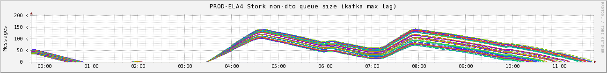
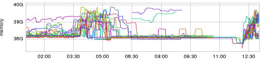
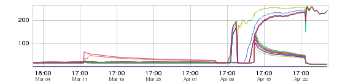
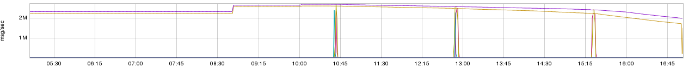

+++
title = "Unintentional Art"
date = "2016-03-04"
slug = "unintentional-art"
draft = false
+++

I had a recent conversation with a colleague about igotw. One of the things that came up was (paraphrasing based on recollection): "I love it when inGraphs unintentionally produces something that looks like an art piece." I happen to have a few examples of this. I don't necessarily recall all of the details of what each one actually represents, but for the most part these are screenshots of inGraphs that I took largely because they were aesthetically pleasing in some way.

**Exhibit A:**

Batches of email hitting the kafka topic for the stork cluster that processes offline emails. The lag goes up, the lag drains off. A rainbow of emails being processed in due time.

**Exhibit B:**

I name this one "kid's drawing" because it reminded me of something my daughters might draw. To be frank: I have no idea what's going on here. I mean, it's an inGraph of heap use...but outside of that I'm mystified. The bit that really draws me in is the two lines - purple and blue-green - in the middle. The start at 06:30, they end at, say, 09:00...what was going on? I wish I knew. (Seriously...in case you hadn't noticed I kind of obsess about this shit. I **really** wish I knew.)

**Exhibit C:**

Once again, I have no recollection of what this inGraph represents, but it reminded me enough of a Chinese dragon that I consider it *ars gratia artis* for the purpose of this post.

**Exhibit D:**

I figured I'd close out with a graph that I **do** understand - yet another kafka lag graph. The reason I chose it for this post is that it looks a lot like a bridge. What is actually happening is kafka consumer rebalances. A consumer gets restarted, another consumer temporarily picks up its partition (and emits lag metrics) while the original consumer is down, and then hands the partition back on the subsequent rebalance when the original consumer starts back up. It's lovely.

_**Call for submissions:**_ A part of the point or this post was to show how interesting inGraphs can be in **any** context. If you haven't started taking screenshots of cool inGraphs then please start doing so. ...and start sending them to me ([igotw-submissions@linkedin.com). I want to see what you're ](mailto:igotw-submissions@linkedin.com) seeing, I want to tell **your** awesome and interesting stories. If you have any kind of graph - it needn't even be an inGraph - and a story to tell about it, **please**

send it my way.
