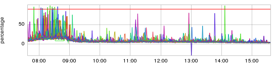
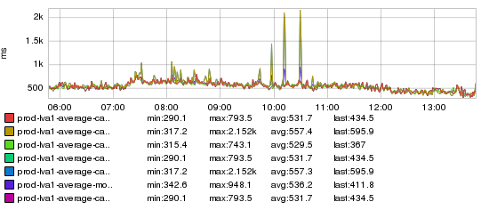
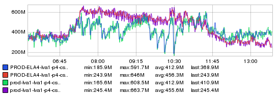
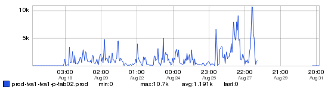

+++
title = "Is It Plugged In?"
date = "2016-03-10"
slug = "is-it-plugged-in"
draft = false
+++

*[Today's inGraph of the Week is a guest submission from fellow SRE Michael Kehoe**. Thanks, Michael! Reminder: folks can always submit graphs, posts,* *anecdotes, or links about whatever metrics* you [*think are interesting to igotw-submissions@linkedin.com*](mailto:igotw-submissions@linkedin.com)*]*

On August 28th 2015, there was a standard load-test of our LVA1 datacenter. Unfortunately the load test failed due to latency from the Identity Super Block (ISB).

Doing a simple search on key dashboards show that there is some high thread pool utilization on identity-mt hosts.

[http://ingraphs.prod.linkedin.com/snapshot/identity-mt_threadpool_util_20150826_223718/](http://ingraphs.prod.linkedin.com/snapshot/identity-mt_threadpool_util_20150826_223718/)

While there's nothing completely catastrophic in that graph, there is obviously something causing some amount of thread pool backup to occur, which can cause user impact on high QPS services. Taking a second (harder) look at the graph, you'll notice that only a handful of hosts have this problem. Keep in mind, identity-mt had 70 hosts per datacenter at the time of the incident.

Cloud-SRE (Eric Manuel) also noticed a similar pattern on a set of cloud-session hosts and put together this nice graph demonstrating the problem:

[http://ingraphs.prod.linkedin.com/snapshot/cloud-session-latency_20150828_204734/](http://ingraphs.prod.linkedin.com/snapshot/cloud-session-latency_20150828_204734/)

Unfortunately the label cuts the naming off, but if you look at the second and fifth rows in the legend, only those have high 'max' values. The different colors are a representation of the 99th percentile latency for cloud-session hosts across each network core/cage of the LVA1 production fabric. The particular core in question is 'P4' which is in Cage C.

Given the graphs, it definitely appears that something is funky in the P4 core. Interestingly we only really notice a problem during peak traffic times which would potentially point to a network capacity problem.

I later on found this graph that demonstrates the problem further. The graphs is for the LVA1 P4 core switch (Interface 4/3). You can see multiple large traffic drops throughout the morning

[http://ingraphs.prod.linkedin.com/snapshot/lva1-p4-csw01.prod_20150828_204242/](http://ingraphs.prod.linkedin.com/snapshot/lva1-p4-csw01.prod_20150828_204242/)

After some digging, Netops were able to find problems the link between: lva1-p-fab02:18/1 & lva1-p4-csw01:4/3.

As documented here in [NEO-22980](https://jira01.corp.linkedin.com:8443/browse/NEO-22980) the interface on lva1-p-fab02 had a large amount of errors. Having a look at the graphs, we can see that this had been happening since the 18th of August.

[http://ingraphs.prod.linkedin.com/snapshot/lva1-p-fab02.prod.linkedin.com:eth18_1_errors_20160305_004100/](http://ingraphs.prod.linkedin.com/snapshot/lva1-p-fab02.prod.linkedin.com:eth18_1_errors_20160305_004100/)

[The subsequent investigation in NEO-23208 details that 'Female to Female MTP connectors were not firm for both port 17/1 & 18/1' on lva1-p-fab02 ](https://jira01.corp.linkedin.com:8443/browse/NEO-23208) causing the errors to occur. After disabling the link on August 28th, the problem went away and normal network performance was restored.
