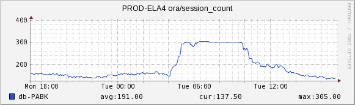
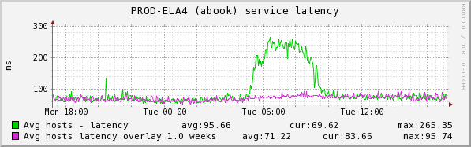
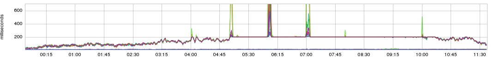
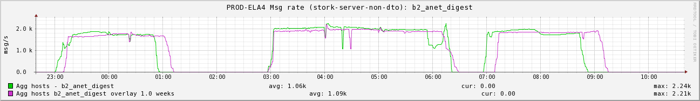

+++
title = "Patterns (The Dreaded Plateau)"
date = "2016-03-17"
slug = "patterns-the-dreaded-plateau"
draft = false
+++

If you spend enough time looking at metrics you start to develop a sense for the patterns you do and don't want to see. Consistency is desirable most of the time; unexpected points of inflection can be alarming ("It just went through the roof/dropped to the floor"). Things moving "up and to the right"/"down and to the right" can also be bad ("It's fallen behind and isn't catching up/it's degrading over time"). Perturbations may occur on a regular basis ("What makes this spike up once an hour, on the hour?") I reserve the right to post about any/all of these at a future date, but what I want to talk about today is plateaus.

Plateaus in metrics can happen for a lot of reasons, almost none of them good. They almost always indicate that some fundamental limitation has been hit, beyond which the service in question simply cannot be pushed. I have a few examples. First up:

The dedicated reader will recognize this graph as I've _posted it previously. It's a good demonstration of the plateau. This metric represent the number of _ seconds spent stalled on garbage collection in a given minute. A glance at the scale should make this plateau clear: there are only 60 seconds in a minute, so in the absence of a reporting/aggregation error you cannot do worse than spending 60 seconds every minute stalling. It should also be fairly obvious why this is undesirable; you don't want your service spending all of it's time collecting garbage (and **not** doing whatever it's actually supposed to be doing.)

On to the next one:

This one represents the session count for the address book database (PABK). Note how it hits 300 sessions and just stays there. I don't recall the specific circumstances, but the flatline at 300 sessions is due to a configuration explicitly imposed in order to prevent a Bad Actor from knocking the database over entirely. Having your database max out on sessions is something you never want. I happen to have an inGraph that demonstrates the impact of this particular example:

Another near-plateau in latency caused by threads waiting to receive a session to a database that is already maxed out.

Our next example:

This a latency metric. See how it flatlines at 200ms? That's because the calling service has been explicitly configured to time out and go on about its business after 200 milliseconds have elapsed. I don't want to get too in-depth about this one - I have a future post in mind for the reasoning behind it - but [it's in the same vein as my post a few weeks ago about tradeoffs](/igotw/2016-02-25-tradeoffs/).

...but it's not all Doom & Gloom. Sometimes plateaus are reasonable, expected, predictable, and even desirable:

What we have here is the send rate for a high-volume batch of a particular email. Once the batch is received the send rate spikes up to a maximum and then sends until it's done sending. Suppose you have 20 million relatively low-priority emails that you want to send. You basically have 3 options:

1. Knock over the site every time a send kicks off because the service (and every one of the downstream services that it has to call) can't handle the load.

2. Purchase sufficient hardware for the service processing the delivery (and every one of the downstream services that it has to call) such that it can do 20M QPS for 1 second and then sit idle while it's not sending.

3. Rate limit the send - either explicitly in code/config or implicitly by allocating fewer machines/threads/etc. - and tune it according to the price /performance tradeoff of what your infra can support vs. the urgency of immediate delivery.

The latter is what we chose. This, my friends, is a natural and healthy plateau.
