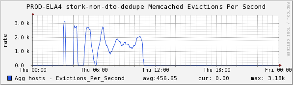

+++
title = "Failure Modes (memcached Edition)"
date = "2016-03-24"
slug = "failure-modes-memcached-edition"
draft = false
+++

At LinkedIn we've migrated off of memcached in favor of _Couchbase for most of our caching use cases, but I thought this story might be useful in the _ greater context of how important it can be to understand how a particular piece of infra works and what assumptions we can make about it. I touched on this subject in a _CBVT Newsletter a while back (which I will likely plagiarize for a future post) but I think it's worthwhile to delve into some detail here._

Here's the inGraph:

First off, a bit of context. Stork/Flock - LinkedIn's infrastructure for rendering and delivering external communications - has a deduplication mechanism backed by a cache. Before delivering anything stork inspects this cache for a unique key generated for each email/push notification/SMS to see whether that key exists. If it does - i.e., if that email/push/sms has already been delivered - then stork will drop it on the floor. If the key is not present, stork puts it in the cache and continues with the send. Records placed in this cache cache have a 7-day Time to Live (TTL) as it's extremely unlikely that a duplicate will be generated after 7 days have passed.

This inGraph represents items being evicted from the cache - entries being removed before their TTL has expired. memcached's eviction policy is Least Recently Used (LRU), and when you see memcached evicting things it's almost **never** what you want (I entitled this graph "painful-lesson-in-slab- allocation" for a reason). So, what's going on here? Why did this happen?

To get to the bottom of this it's important to understand a little bit about how memcached's internal memory management works. memcached handles its memory in 1MB "slabs" that are reserved for data ***of a particular size***. Slabs are allocated based on data size in an attempt to reduce fragmentation; e.g., you don't want to be storing a 1-byte record in a slab that has been reserved for 512-byte entries because that would be wasting the other 511 bytes per record.

The crucial bit here: memcached's LRU eviction is not global, it is **per slab class**. What happened is this: after months of humming along just fine a new email campaign was introduced whose dedupe data was of a different size and thus fit into a different slab class.

The way I describe this to less-technical folks:

1. You have a sock drawer with 10 rows of knee socks, neatly arranged in piles of 10.

2. You buy 20 million ankle socks and need a place to put them.

3. You remove 1 of the 10 rows of knee socks in order to free up room for your ankle socks in the drawer.

4. Once you have placed 20 pairs of ankle socks in that slot you realize you can't fit any more, but that's the only slot available for ankle socks so...

5. You start tossing ankle socks out one at a time and replacing them with another pair of ankle socks.

6. Repeat until you've gone through all 20 million.

