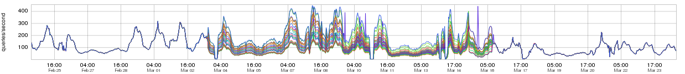
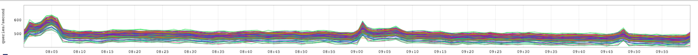

+++
title = "Mystery Edition"
date = "2016-03-31"
slug = "mystery-edition"
draft = false
+++

Another mystery! Apologies for the differing timescales and weird differences in aspect ratio (I suck at cropping).

What's going on here? What do these two metrics have to do with one another? What is the common thread here? All will be revealed on Thursday.

**Update:** A quick point of clarification here: the timeframes do not line up at all because these two metrics have nothing to do with one another in terms of a specific incident/Thing that Happened. The relationship between these two inGraphs is purely thematic.

tl;dr summary: The commonality between the two graphs is load balancing.

Following [the ticket trail](https://jira01.corp.linkedin.com:8443/browse/TRAFFIC-5537), the first graph appears to have been a bug in ATS that caused incoming traffic from l1proxy to chrome-tomcat (think: global nav) to be severely unevenly distributed for ~2 weeks. This resulted in a super-awesome graph for me to post, for which I am grateful in spite of site impact. What I want to call attention to: look at how well-distributed the load is before and after the bug. It's tight enough that it could almost be a single metric being emitted from a single machine, so tight that one might not even know multiple metrics were being represented.

The second graph is actually more interesting to me. It demonstrates the distribution of traffic to a high-QPS service via d2. The units are difficult to discern visually, but notice how the lowest-QPS node consistently receives something on the order of 25% less traffic than the highest-QPS node.

To be fair this isn't an apples-to-apples comparison. On the Traffic side l1 has the benefit of having a single client (l0); the Traffic team controls "both ends of the pipe" in their domain. By comparison a d2 service could have dozens of clients, each of which has been tuned for its own specific requirements.

It's generally the case that the more clients your service has the less likely you'll be able to predict specific access patterns. That said, it would seem that there is room for improvement here. Even at steady state - no spikes in latency or failures - there is a significant gap between the highest- and lowest-QPS node for incoming d2 traffic. Perhaps there are lessons to be learned from ATS load balancing that could be applied to how d2 behaves at steady state?
