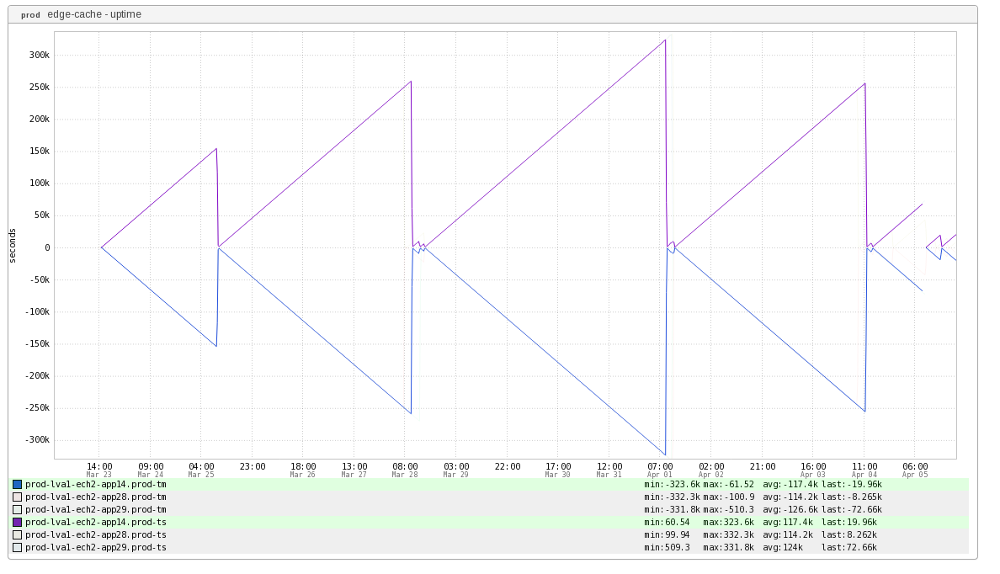

+++
title = "Reverse Polish Notation"
date = "2016-04-07"
slug = "reverse-polish-notation"
draft = false
+++

*[Apologies for the relatively "thin" post this week; I've been at SREcon all day. Hopefully this awesome graph - and potentially discovering a feature of*

*inGraphs you may not have been aware of - makes up for it.*  *]*

Today's post is a two-for-one sale: both a beautiful inGraph **and** a useful feature of inGraphs. Let's start off with the graph:

As per the label this an edge cache uptime graph and appears to be two related processes in ATS. Here's what the graph definition looks like:

- title: edge-cache - uptime defs: - range: '%prod-ech2.edge-cache.1' label: traffic_manager rrd: ats/proxy.node.restarts.manager.uptime.rrd - range: '%prod-ech2.edge-cache.1' label: traffic_server rrd: ats/proxy.node.restarts.proxy.uptime.rrd RPN: - expression: -1,traffic_manager,* label: tm - expression: traffic_server label: ts params: vlabel: 'seconds'

[The bit that I would like to call attention to is the RPN (Reverse Polish Notation) stanza. There are two metrics here labelled ](https://en.wikipedia.org/wiki/Reverse_Polish_notation)*traffic_manager* and *traffic_ser* *ver*. The RPN bit says to take each data point in the time series for *traffic_manager* and multiply it by -1, and take each data point in the time series for *traffi* *c_server* and simply return it. It would also appear that both of these processes get bounced at the same time (or in quick succession), which gives us this lovely inGraph.

*[Edit: I'd meant to give attribution to Jerrish Thomas for pointing this particular inGraph out to me.]*
