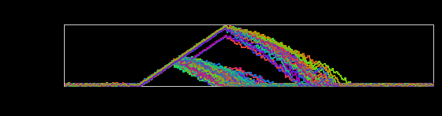
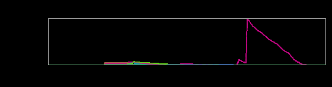

+++
title = "Failure Mode (Redux)"
date = "2016-04-14"
slug = "failure-mode-redux"
draft = false
+++

This week's igotw comes from _Lester Haynes_ - Search SRE - who has pointed out some super-interesting inGraphs that illustrate stale search results. I know very little about the Search stack, but these inGraphs resonate pretty strongly with me because they mirror metrics I've seen in the past. First up:

If this looks familiar then you've been paying attention - a very similar graph appeared in a _previous post. Latet SCN Age is the rough equivalent of kafka _ lag in databus-land. ...and then there's this one:

Perhaps to the dedicated reader _this post looks familiar? Per Lester: "I_t's not always possible to get a clear signal of consumption failures from the metrics provided by the databus client library (let alone alert upon it)." ...and furthermore: "You can't always rely on metrics provided by the application itself". This last bit was the thing that really hit home for me. I know this is a bit abstract, but if you take nothing away from this it should be the following: client metrics will lie to you.

In Lester's own words: "You can't always rely on metrics provided by the application itself. Time and time again, it's been demonstrated that a stronger signal can be generated by monitoring ancillary applications."
