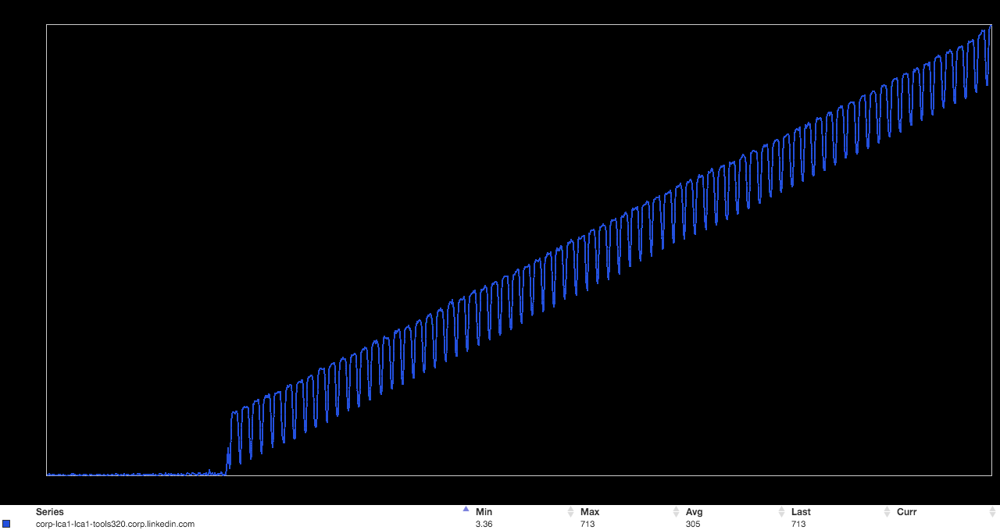
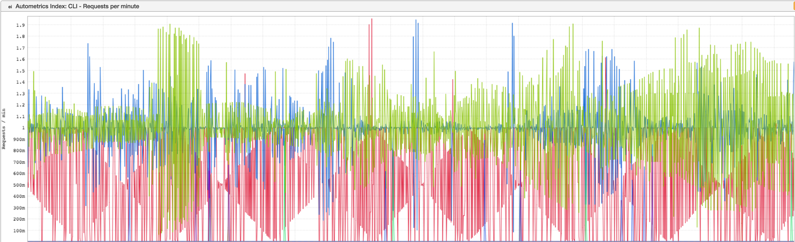

+++
title = "Unintentional Art"
date = "2016-04-21"
slug = "unintentional-art"
draft = false
+++

[Prince died today and I'm kinda torn up about it, so we're going to take a look at a couple of inGraphs that really just look kinda cool. Thanks to ](http://www.vox.com/2016/4/21/11481122/princes-guitar-solo-for-while-my-guitar-gently-weeps-shows-one-of-his-unrecognized-skills)_Loren _ _Carvalho_ for this one, which I entitle "The Escalator to Nowhere":

I'm not entirely sure what's going on here, but presumably this up-and-to-the-right load average trend was disconcerting to some Tool somewhere.

Next up:

_Sick. Thanks to Richard Waid and __Karrick McDermott - I'm not sure who first discovered it. That diamond pattern with its weird limit at 1, and the other _ metrics looking like seismograph readings. ...what on earth is going on there? No idea.

Seriously, go listen to Purple Rain.
