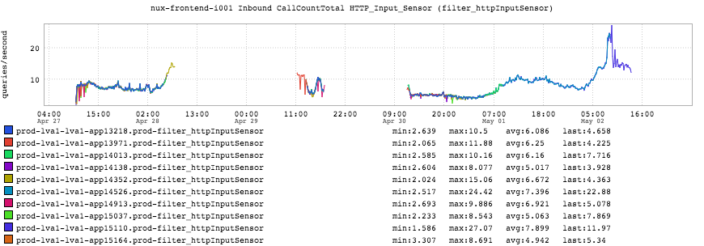

+++
title = "Fallout"
date = "2016-05-05"
slug = "fallout"
draft = false
+++

This week's post is a follow-on to last week's post about [Mistaken Assumptions](/igotw/2016-04-28-mistaken-assumptions/). It's a bit of a study in the fallout that can happen post-incident. Let's take a look at the inGraph:

It's worth taking a look at [the snapshot](http://ingraphs.prod.linkedin.com/snapshot/oom-killa_20160506_033629/) and scrolling over the legend here. QPS showing up then dropping off, more or less at random...what fresh hell is this?

Well, as it turns out there is a fairly serious kernel bug specific to the cgroup oom-killer that we've come across as a result of the migration to Rain. At some point after the prior GCN the "new" nodes started taking traffic and then started dying off due to the bug. I don't want to write it up again so I'm going to "cheat" and copy-paste the email I sent about it:

There is a gnarly kernel bug that is causing significant issues with services that have been migrated to rain. They manifest as follows: 1) The rain slice has been configured with a cgroup memory limit that is close to the maximum heap size of the service 2) The service goes over the memory limit configured for the cgroup 3) The oom-killer kicks in and attempts to kill off the service 4) The kernel and the service go into a pathological livelock state, as described by:

The service becomes a <defunct> zombie The service has a parent PID of 1 (init) The service maintains its hold on the port it was listening on

None of this is supposed to happen. Ever. Zombie processes that are reassigned to init as a parent are supposed to be reaped. That is not happening due to the livelock bug. This is serious as it requires a reboot of the actual physical node in order to clear this state. In a certain sense the prior GCN was "good" in that it was a single all-at-once catastrophic failure of a service; it was easily-identifiable and relatively simple to recover from once understood. Nodes dying off mysteriously one-at-a-time until there are none available to take traffic is a much worse kind of escalation. "But Cliff!" you ask, "Why does the QPS keep popping in and out like that?" Well, gentle reader, it turns out that there is **another** bug whereby deleting instances of a service that is using ASP tags doesn't "stick"; i.e., every new deploy of the service spins up the misconfigured nodes anew, and they die off as the bug takes hold once more. It's not all Doom and Gloom, though. Things are breaking on the Internet all the time...don't let it get you down. This one is tricky and I assure you: we've

got Top Men working on it.
