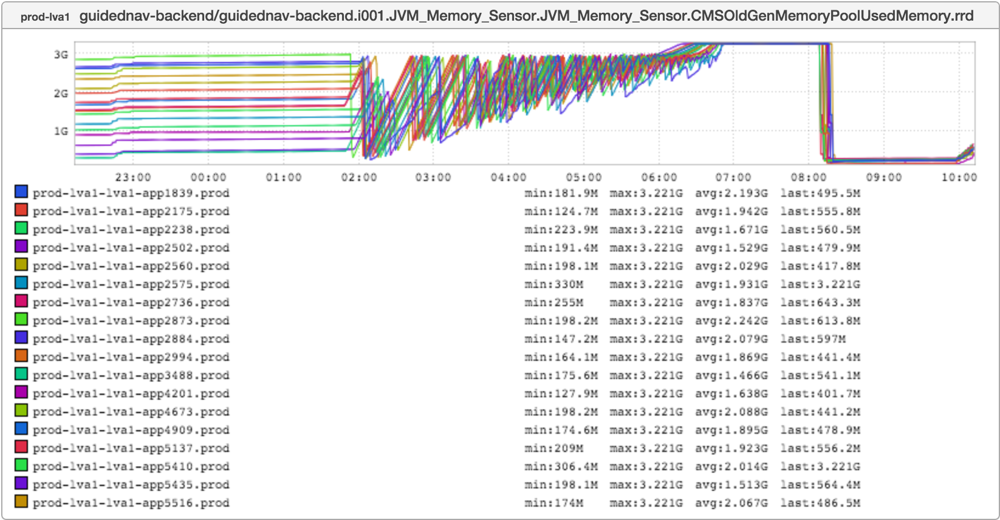

+++
title = "The Number(s) of the Beast"
date = "2016-05-12"
slug = "the-number-s-of-the-beast"
draft = false
+++

_This week's igotw comes from an incident that Kathleen Shannon and I looked at a while back. One of the services Katie supports - _guidednav-backend - had been running for months without incident, and then all of a sudden just up and fell over. She bounced it and it came back up, but we were curious: What the devil had happened? While we were poking around through metrics this graph jumped out:

I really love this inGraph. I wish I had another snapshot with a longer timeline. The service was just humming along with a completely normal garbage collection pattern and then all of a sudden goes into this super-awesome GC death spiral. Collections get tighter and tighter, reclaiming less and less heap, until it finally flatlines. So...why?

Well, I mentioned before that the service had been running for months. How many months? Something on the order of 8 months - 248 days, to be a bit more precise. Google "248 day bug" and you come across interesting (and terrifying) stories [like this one](http://www.engadget.com/2015/05/01/boeing-787-dreamliner-software-bug/). Why 248 days? Well, because the maximum value that a signed integer can hold before overflowing is 231-1 centiseconds. It would appear that there is some timer in the JVM that rolls over after 248 days and wreaks havoc.

Java doesn't "do" unsigned ints, but some things do. Perhaps some of you have been around long enough to recall our load balancers falling over after 497 days. Funny thing about 497...it's almost exactly twice 248. 232...add a single bit and you double the amount of time you can stay up before Bad

Things Happen.
