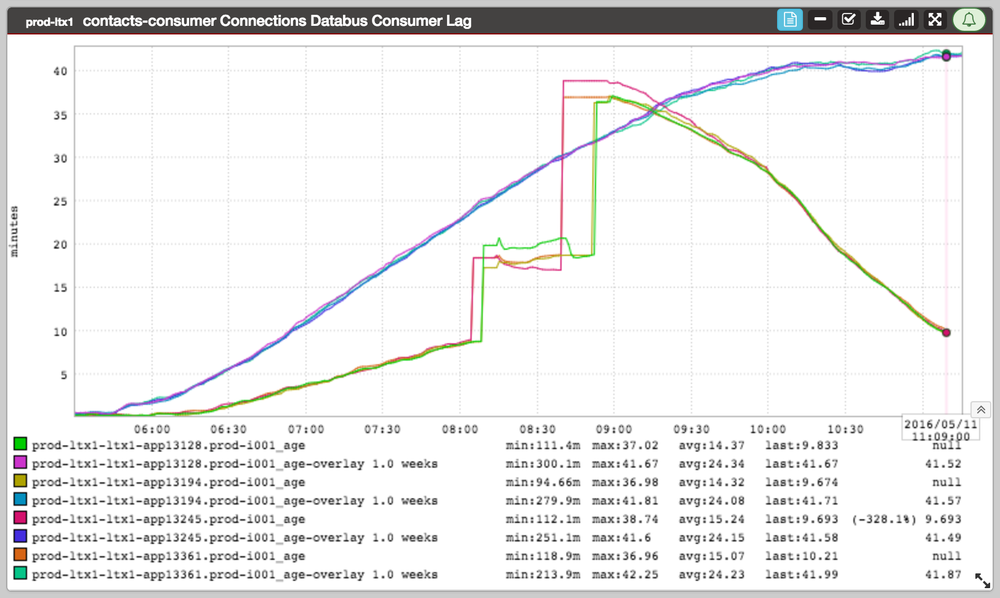
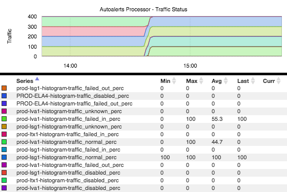
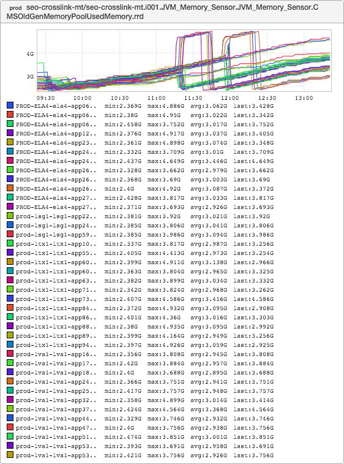

+++
title = "Unintentional Art"
date = "2016-05-19"
slug = "unintentional-art"
draft = false
+++

*[Thank you to everyone who contributed the inGraphs in this post. I don't recall specifically who submitted all of these, but most (all?) of them were* *provided by someone other than me.]*

Just a few interesting bits of inGraph art this week. First up, some databus consumer abstract art:

Next:

Kind of makes me think of something one might see on the side of a van in the 70s. ...and finally:

For some reason this makes me think of the classic [Hulk Hogan pose](http://i.imgur.com/KcAZcTm.jpg). Maybe that's just me. Seriously: look at him. Look at the graph. Now look at him. Now look at the graph.

Give it time, it'll sink in.
