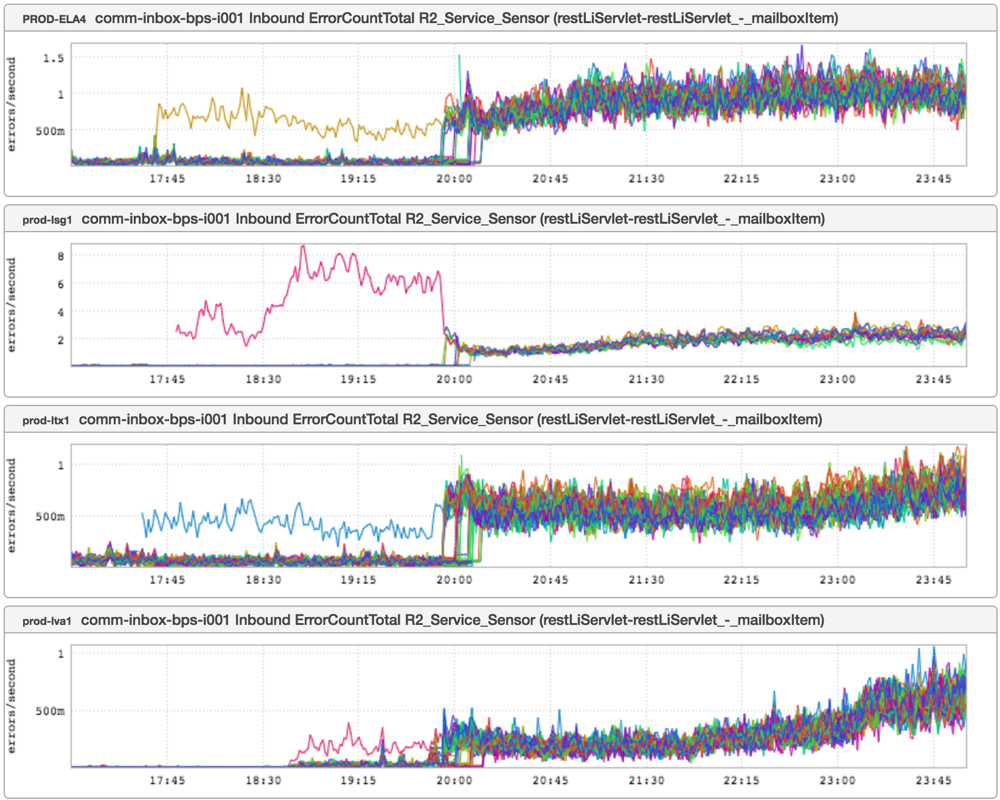

+++
title = "Troubled Canary"
date = "2016-05-26"
slug = "troubled-canary"
draft = false
+++

This week's igotw is fairly similar to the [very first igotw, in which I talked about production code deployment at LinkedIn and how it can go badly. We saw ](/igotw/2016-01-07-not-learning-from-mistakes/) along those lines this week:

These are inGraphs of error rates. Canaries in all 4 fabrics pretty clearly show an increase...and yet the promotion still happened. How does this happen?

Well, the first post I mentioned hearkens back to the Bad Old Days. The canary strategy was effectively "canary the code, look at Every inGraph Ever, and if nothing moved then it's (probably) okay so go ahead and promote". This is completely unmanageable as strategies go, so we put some automation around it. Enter: EKG.

The promise of EKG from an end-user perspective is to be able to detect this sort of deviation; to say: "You made a change? Well, here's what happened as a result of that change, and furthermore I think it's okay/not okay." Unfortunately, this is a **very** hard thing to do. Some challenges to consider:

Not every service has the same performance characteristics Not every service has the same performance characteristics on a specific day/hour Not every service has the same performance characteristics when any given fabric has been failed out of Not every service has the same "acceptable" error rate Not every service has the same "acceptable" error logging Not every service has the same "acceptable" error tolerance from downstream services

This is not an exhaustive list by any stretch of the imagination, but I hope it's illustrative of my point: The problem EKG is attempting to tackle is simple in the common case, but is Fucking Hard when generalized (because that's how Life Works.)

"But, dude, this was a super-obvious spike in errors", you say. "This is an easy case that should have been caught." Okay. I hear you, buddy. ...but suppose this is an older codebase that throws a million exceptions an hour. Suppose the canary introduced code that removed 10,000 of those exceptions that are harmless and introduced 10,000 that are harmful. Suppose it's done that for every canary for the past 6 months. What then?

I'm not trying to be an EKG apologist - it's under Code Yellow at present, and for a lot of good reasons. My point is that the onus isn't entirely on the engineers trying to make EKG work. Please, take a step back and look at what kind of bullshit you may be spewing into your logs. The quality of the output is and always will be directly related to the quality of the input.

[tl;dr: GIGO](https://en.wikipedia.org/wiki/Garbage_in,_garbage_out)

