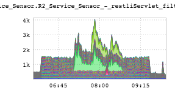
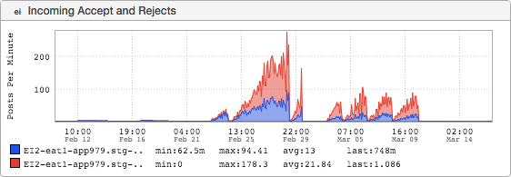
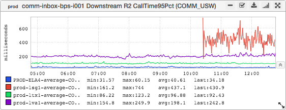

+++
title = "Fire"
date = "2016-06-02"
slug = "fire"
draft = false
+++

Everything is breaking on the Internet all the time and this week was no exception. This post is not about that, mostly because it's been a Long Week in spite of being a short week. Instead let's take a look at some bitchin' inGraphs that happen to look kinda like fire.

First up:

I entitle this one "login-server on fire". It's a stacked latency graph and I don't understand that, but it sure does look nifty. Next:

I like this one because it has some motion. Or maybe looks like a mommy fire (and her diminutive husband) shepherding her 4 baby fires along. And finally:

Ah, lsg1. You beautiful provider of interesting inGraphs.

*[BTW - Irrespective of the "fire" theme, the latter graph has a few interesting tidbits in it that I didn't cover directly. Look at it. Think about it/unpack it a bit.*

*Ask me about it, if you like; I'm happy to talk about it.*  *]*

