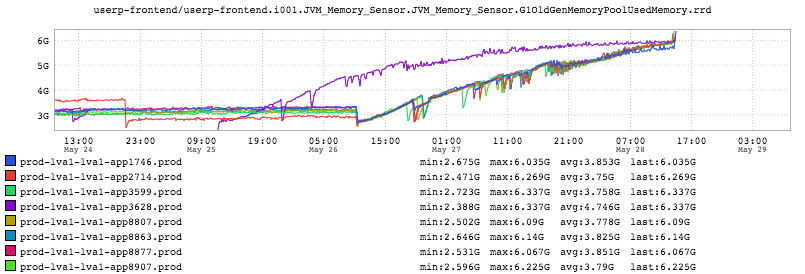
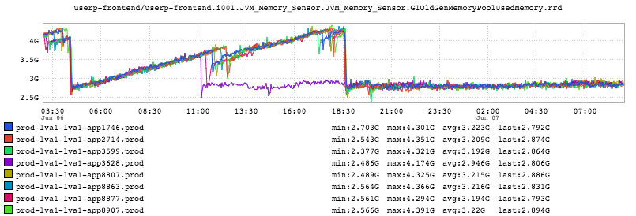

+++
title = "Patterns (Up and to the Right)"
date = "2016-06-09"
slug = "patterns-up-and-to-the-right"
draft = false
+++

There are some metrics you want to see go up and to the right. An example that I think will resonate: [LNKD share price. That said, there are many times ](https://www.google.com/finance?q=NYSE:LNKD) when up-and-to-the-right is something you do **not** want to see. For instance:

This is what a memory leak looks like. Things are humming along just fine, and then some new code is deployed and memory use just climbs and climbs until the JVM seizes up in GC Hell, stops emitting metrics, and falls over altogether. The canary stands out in this inGraph (and I've [posted](/igotw/2016-01-07-not-learning-from-mistakes/) about [busted ](/igotw/2016-05-26-troubled-canary/) [canaries getting promoted before), but I'll file this one under the category of "Hindsight is 20/20". Memory leaks can be insidious. This wasn't an immediate ](/igotw/2016-05-26-troubled-canary/) and obvious step-function increase. In fact it took **days** for the service to actually fall over, in this case. (Perhaps worth noting: this inGraph looks a bit like a fishing pole, and a bit like the head of a dragon. Just sayin'.)

This story has a happy ending, though:

Spend a little time looking at this inGraph, because it's Truly Awesome. This is what a **good** canary should look like. In the abstract, "Up and to the Right" is what we were trying to remedy. The canary clearly decreases the slope - high fives all around! We were able to build confidence that this specific build

fixed the problem over the canary period, so we promoted and now it's fixed.
