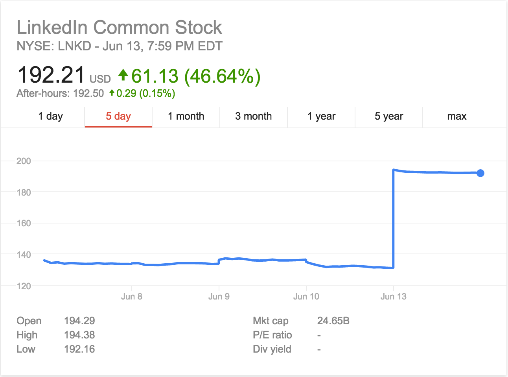
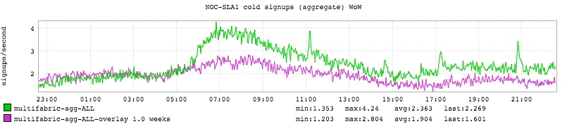

+++
title = "Acquisition Edition"
date = "2016-06-13"
slug = "acquisition-edition"
draft = false
+++

[It has been a supremely weird day](http://www.wsj.com/articles/microsoft-to-acquire-linkedin-in-deal-valued-at-26-2-billion-1465821523), folks. I haven't the faintest idea what the future holds - I'm maintaining a standpoint of "cautious optimism" for the now - but what I **can** provide is a couple of interesting data points in the short term. The first is actually not an inGraph, but I'll bet you've stumbled upon it:

Step function changes in metrics are typically undesirable. Speaking strictly as a shareholder this one is decidedly desirable. Now here's one that you may not have seen just yet:

This is a graph of cold signups for the past 24 hours. A "warm" signup occurs when a guest - a non-member - accepts an invitation from an existing member to join LinkedIn. By contrast, a "cold" signup is when a non-member takes it upon herself to come to the site and register a new account. As it happens just about any kind of press can cause a spike in cold signups, and the acquisition was no exception. Right around the time I started at LinkedIn [Conan O'Brien decided to start a campaign to conquer LinkedIn. Unfortunately I do not have an inGraph of that (ancient history - I think we were still ](https://www.youtube.com/watch?v=cinb5tcRYXw) chiseling metrics into stone tablets way back then) but if memory serves it looked fairly similar.
