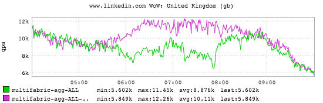

+++
title = "Euro 2016"
date = "2016-06-16"
slug = "euro-2016"
draft = false
+++

[I posted before](/igotw/2016-02-11-the-superbowl/) about (American) football and its impact on site traffic. Now let's take a look at what kind of impact what the rest of the world considers to be **real** football has:

This is UK site traffic during the [Euro 2016 second round game between England and Wales. The super-awesome thing about this: the UEFA site has a ](http://www.dailymail.co.uk/news/article-3644279/UK-grind-halt-Battle-Britain-costing-economy-200m-workers-tools-watch-England-play-Wales-Northern-Ireland-action-too.html)[mi](http://www.uefa.com/uefaeuro/season=2016/matches/round=2000448/match=2017887/index.html)

[nute-by-minute recap](http://www.uefa.com/uefaeuro/season=2016/matches/round=2000448/match=2017887/index.html)[, so you can actually align the timing of the 3 goals scored in the game with the sharp dips in site traffic. Go ahead - try it out](http://ingraphs.prod.linkedin.com/dashboard/traffic-top20-cc-by-domain/graph/www.linkedin.com%20WoW:%20United%20Kingdom%20(gb)?fabric_groups=prod&multifabric&use_time_selector&start_time=1466074800000&end_time=1466096400000)!
