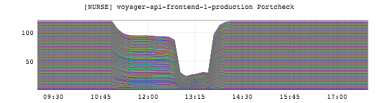
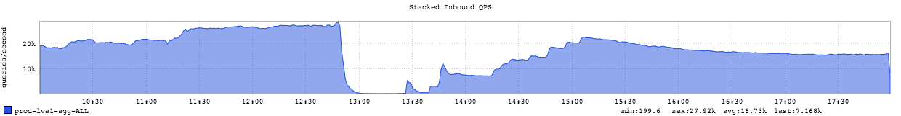
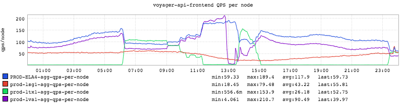

+++
title = "Compounded Complexity"
date = "2016-06-23"
slug = "compounded-complexity"
draft = false
+++

Sometimes outages occur because of a single specific thing - someone made a mistake, something broke somewhere, perhaps something out of our control just plain Happened. Often it's a little more complex than that - multiple factors that push us into a site-down situation. This post is about one such occasion.

Factor #1: [A GCN](https://jira01.corp.linkedin.com:8443/browse/GCN-21172) that should give you the heebie-jeebies because it has the words "data loss" in the title. I do not have an inGraph that demonstrates the data loss and I'm not even sure what it would look like if I did. (Jesus, I wish I did. If you have an inGraph that demonstrates this I really want to see it then [please, hit me up.) The upshot of this particular incident: it resulted in site traffic being shifted out of prod-ltx1, which put all traffic into our remaining fabrics ](mailto:csnyder@linkedin.com) (ela4, prod-lva1, prod-lsg1). This means that roughly 65% of traffic to Voyager was going to prod-lva1,. I **could** find an inGraph of that, but it's not particularly interesting and it will become clear soon enough so bear with me here.

Factor #2: [A GCN](https://jira01.corp.linkedin.com:8443/browse/GCN-21185) that caused deployment failures for any service using sc-deploy for static content deployment on service startup, which resulted in something on the order of 20% of Voyager nodes being down with no way to bring them up. This is what that looks like:

There's a bit of foreshadowing here since you can see the sharp dropoff around 12:48, but focus on the decline in the number of hosts up around 11:00 or so. I'm a little fuzzy as to what happened to make those nodes go down - whether it was explicit deployment activity or automated restarts - but those details will come out in postmortem. The point is: some nodes were brought down and couldn't subsequently be brought back up until static content deployment was un-fucked.

Factor #3: Voyager hits global peak right around 12:48. This is what that looks like:

Do you see that little "bump" around 12:48, just before the obvious trough? That little bit of extra QPS was enough to push the entire service over, putting it into GC Hell and taking it down entirely (as can be seen by the precipitous decline in QPS). Another view of this:

This inGraph shows per-node QPS. There is a lot of information packed into it, but look at that spike in prod-lva1 around 12:48, followed by Precipitous Disaster.

I suppose the silver lining here is that we had the opportunity to explore Voyager's tipping point, even if we did do it The Hard Way.

