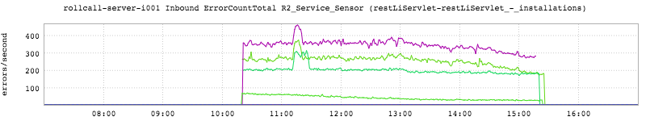
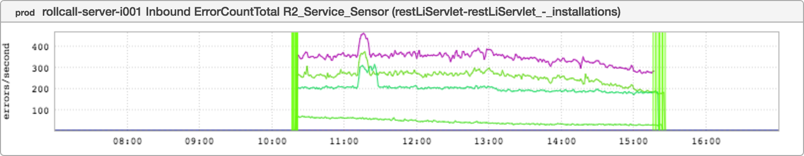

+++
title = "Successful Canary"
date = "2016-06-30"
slug = "successful-canary"
draft = false
+++

I've posted before about [busted canaries that wind up ](/igotw/2016-05-26-troubled-canary/)[getting promoted](/igotw/2016-01-07-not-learning-from-mistakes/). This post is about a canary success story. Make no mistake, it was one sick bird... **but** it was caught and rolled back while limiting overall member impact. Check it out:

This inGraph shows errors/second for the rollcall service. Notice that There. Are. Four. Lines. That's because we have four production fabrics, and when we canary we deploy the new code to one node per fabric. (Worth noting: we also deploy one per container and one per instance. In the common case - as above - there is one container and one instance). It was broken for around 5 hours, which to be frank is a little longer than I'd like to see but it's still preferable to breaking everything all in one go.

This is also an excellent opportunity to showcase a super-cool feature of inGraphs: the informed overlay.

Pretty much any time something happens in production at LinkedIn - a LiX ramp, a deployment, etc. - a record is logged in informed. inGraphs integrates with this tool such that you can filter by source and/or search for a specific event and overlay those events directly onto your metric. This can be super- helpful if you're trying to correlate a change in metrics with some event that's occurred. Fair warning: A **lot** of stuff gets emitted to informed so it can tend to be a bit of a "murky bucket" if you don't know what you're looking for.

The above shows a search for "rollcall" in informed. Note the distinct green vertical bars at the beginning of the uptick in errors (the canary deployment) and the second set of bars at the subsequent decrease (the rollback). Pro tip: you can **also** right-click-drag over any set of vertical bars to get the metadata for the informed event - who, what, when, etc. Try it out some time!
