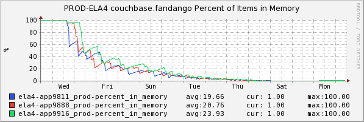

+++
title = "Cache Replacement"
date = "2016-07-14"
slug = "cache-replacement"
draft = false
+++

For this week's post I'm going to borrow from a _CBVT newsletter article_ I wrote a while back. (I know it's kind of "cheating", but I'm on DTO this week and it's quicker to re-hash an old post). The tl;dr summary: couchbase does not implement any kind of replacement policy, so if you don't either (1) set a TTL on your records or (2) explicitly delete records when you no longer need them, then it will happily hold onto all of your data indefinitely. This will eventually lead to all available RAM filling up, records being ejected to disk, and a pretty big hit to performance.

Here's an inGraph of what that looks like:

This represents the percentage of records that this couchbase has in memory. If you're using couchbase as a cache you typically want this to remain at 100%, since as I mentioned you start taking a performance hit as records get ejected to disk. Note it starts off at 100% and then over time falls off until it eventually bottoms out at 0% (every record has been ejected). Also worth noting, couchbase has a certain amount of metadata per record that it **must** keep in RAM (i.e., that it cannot flush to disk) so after some amount of time it will run out of RAM for storing metadata and fall over entirely.

The lesson here: If you are not using couchbase as a persistent data store (for example, if you're using it as a cache) **always** either set some reasonable TTL or make sure you're cleaning up after yourself.
