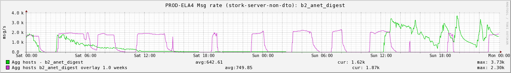

+++
title = "Hindsight"
date = "2016-07-28"
slug = "hindsight"
draft = false
+++

In this week's post I'd like to share a little personal embarrassment that will hopefully be a learning opportunity. We'll start off with the inGraph:

Those familiar with inGraphs will recognize this as being a very old snapshot. For those less-familiar: same bright green for current week, same weird pinkish color for previous week. It depicts the send rate of a high-volume email campaign. For (hopefully) obvious reasons I've somewhat affectionately entitled it "storky-no-sendy.png". Over the course of a weekend this particular campaign slowed down and then stopped sending altogether. Why did this happen? Fuck if I know, that was **years** ago. I recall that it was related to memory use/garbage collection. What I **can** tell you what I did about it and why what I did was really stupid.

To recount the weekend's events as I recall them (again, this was a good long while ago): I got a call that Sunday morning about this particular email campaign's volume being down. I got on VPN and checked out ingraphs and - lo and behold - the thing wasn't sending at all! I tried turning it off and on again. It worked - the email started sending again - but the rate started to decline. We had one hell of a backlog to catch up on by that time so I suppose I panicked a bit. I knew that the limiting factor was memory and that the service had some garbage collection issues, so I decided maybe it would be a good idea to try out G1 garbage collection.

*Side note: G1 is wizardry. It's a Magic Fix to JVM tuning. Long story short: it uses internal heuristics to self-tune for a target GC duration. "What, you mean* *I don't have to tune 40 different flags to get reasonable GC performance? Sold!" It has its pitfalls (see above & below) but I love it so don't let what I'm* *about to write dissuade you from using it because by and large it's The Way, The Truth, and The Light...except for when it's not.*

So I bang out some config values that enable G1 GC instead of CMS. I push the configs and everything looks great. ...and then send rates start to fall again. ...and I bounce the service again. ...and send rates fall again. ...and...well, I think you get the idea. I spent the better part of a Sunday/wee hours of Monday baby-sitting the damned thing until the sends were done.

Why? Well, a bit of background on how our email infra works (or at least used to work...I don't own it any more so it may have changed): back then it would generate a new class *per email sent.* Class metadata in the olden days used to be held in a memory region called *PermGen*, which could be garbage [collected (lol there was a flag for that](http://stackoverflow.com/questions/3334911/what-does-jvm-flag-cmsclassunloadingenabled-actually-do)). However, [when using Java 7 a G1 PermGen GC meant a Full GC.](https://blogs.oracle.com/poonam/entry/about_g1_garbage_collector_permanent)

So as it turns out I actually made the problem *worse* by pushing out configs that enabled a GC mechanism that did not mesh well with the performance characteristics of my service. We used to send something on the order of 400M of this particular email a week - each of which generated a new class that was stored in PermGen - and my config change cause a stop-the-world GC every time PermGen was full.

"You have to know everything about how everything works" doesn't seem quite reasonable, so my point is more about not making drastic changes on off hours that you *think* will be helpful. Or put more simply:

Be careful out there, folks. There are things you do not know yet.
