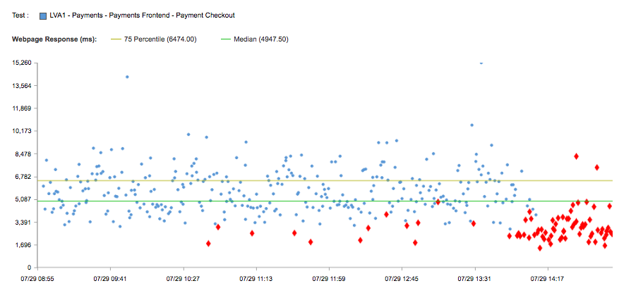

+++
title = "Catchpoint Edition"
date = "2016-08-04"
slug = "catchpoint-edition"
draft = false
+++

[Busted](/igotw/2016-01-07-not-learning-from-mistakes/)[ canaries aren't exactly new territory for igotw, but this week's post is a little different. As you may have already noticed - ](/igotw/2016-05-26-troubled-canary/)**gasp!** *there is no inGraph*  - *in this post!* _Don't worry, it's not going to become a habit...but when Jim Ockers - one of our Edge Performance SREs - pointed out the scatterplot below I _ couldn't resist the opportunity to share it. Let's see what we're working with here:

[So what is it? Well, one of the many things our Edge Perf team does is to help set up and maintain our monitoring alerting through Catchpoint (a third-party ](http://www.catchpoint.com/) service we use for monitoring global availability). Each dot represents a given test, with the y-axis showing the response time for that test in milliseconds. The blue dots are the successful tests, the red dots are the ones that failed one or more of the criteria configured for the test. The plot itself doesn't give any information about what failed specifically but some typical examples are a non-2XX response code, an incorrect pagekey being returned, and/or some expected HTML element in the payload that's gone missing.

Notice how the failed tests are sparse at first, starting around 10:30. For those familiar with the deployment machinery there should be no surprise at the timing; auto-deployment kicks in at 10:00 for nominations that missed the previous day's deployment window, so around 10:20 or so is when all of the queued up deployments start to hit each day. The only tests that fail are the ones hitting the canary by the luck of the draw. ...and then around 14:00 the canary is promoted - rolled out to the rest of the fleet - and...well...Catchpoint goes all angry red.

