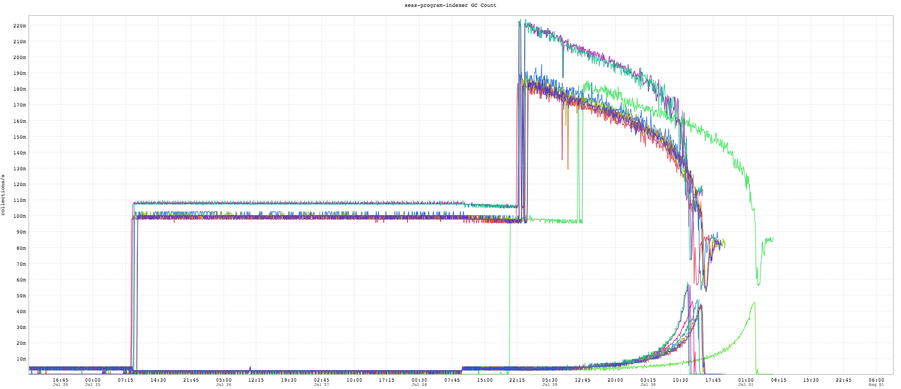
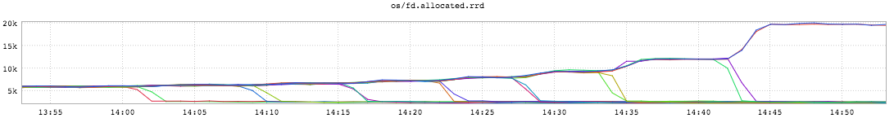
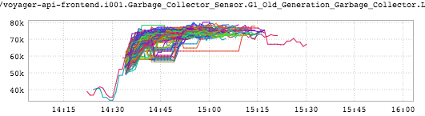

+++
title = "Unintentional Art"
date = "2016-08-11"
slug = "unintentional-art"
draft = false
+++

I haven't done a UA post in a little while so I've got a handful of interesting inGraphs for you today. First up, a little something _Mark Feinstein_ sent my way:

I've been kicking around some theories in my head about what's actually going on here, but one way or the other it makes a nice piece of art. Next, a little inGraph I like to think of as The Caterpillar:

This one's fairly straightforward: a "manual" redline test in which we shut down a couple of nodes at a time to see how the remaining nodes performed - in this particular case, wrt how many open file descriptors each one held. Oh, and it looks kinda like a caterpillar.

And finally, this little gem:

...because phasers, pew pew!
