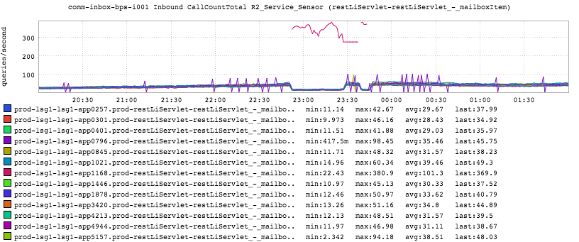

+++
title = "Order of Operations"
date = "2016-08-18"
slug = "order-of-operations"
draft = false
+++

I was poking around my stash of inGraphs snapshots earlier today and I stumbled across one that I couldn't immediately place:

It took me a little while to recall exactly what had happened in the Ancient Past (lol at **least** 2 months ago) but I think I've pieced it together.

First of all, the graph title gives a strong clue: inbound QPS to a comm-inbox-bps endpoint. The hostnames give yet another: these are all hosts in the prod- lsg1 fabric. ...and one host went completely apeshit for a brief period of time. So...what does it mean? What happened?

In order to understand that we'll need to delve into how SSL support for rest.li calls works at LI. There are basically 3 changes required to enable SSL support for a previously-unsecured d2 endpoint. As the post title suggests doing them in the correct order is important. *(Side note: this post assumes some* *knowledge of how r2/d2 work for the sake of not making it encyclopedic. Feel free to hit me up if you want more details in that arena.)* These steps are:

1. Enable announcement of endpoints over HTTPS to d2.

2. Configure clients to speak HTTPS.

3. Configure d2 to prioritize HTTPS over HTTP when clients request a set of URIs.

To contradict myself wrt ordering: these steps are actually **somewhat** interchangeable. d2 is "smart" enough to fall back to HTTP if HTTPS has been prioritized but there are no HTTPS endpoints available. **However**, if you have clients that have been configured to request HTTPS endpoints and you canary a config change for enabling HTTPS then...well...you end up with an inGraph like the above. So if I'm recalling this correctly, what happened was this:

1. (Some) clients had already been configured to request HTTPS endpoints.

2. d2 was configured to prioritize HTTPS over HTTP.

3. A config change enabling announcement over HTTPS was canaried.

So a single host was canaried with config that made it announce over HTTPS, and that host started receiving **all** traffic from clients configured to prefer HTTPS.

