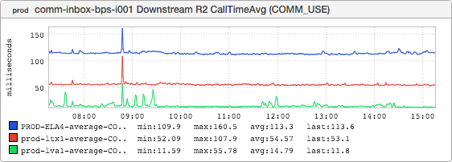

+++
title = "The Speed of Light"
date = "2016-08-25"
slug = "the-speed-of-light"
draft = false
+++

_I've posted about this kind of thing before, but I've gotten a lot of questions in the past week or two about how the Messaging (n_ée Inbox) data layer "works" so I thought it might be worth talking about a bit. I was asked recently "What is the name for this architecture?" and I did not have an answer to that question. It is not single-master (as we think of it). It is not multi-master (as we think of it). The best name I might be able to come up with it is "multi-single- master". Basically, it is sharded into East and West shards (ignoring lsg1 and the Asia-Pacific shard for now), with the Master residing on the east coast /west coast (lva1/ela4, respectively) and the replicas residing smack-dab in the middle of the country (ltx1). Roughly 50% of member Messaging data is held in either of these shards and the mapping from member to shard is maintained by a service called PDR - a simple K-V whose entire purpose is to map MIDs to their respective shards.

**Pay attention to the bold text: That's way too much information, you don't want details you want the inGraphs.** Well, igotw delivers:

While I hate average latencies (a subject for another post, perhaps) I love the symmetry of these two inGraphs side-by-side as a basic demonstration of the speed of light.

Latencies to USE (mastered on the east coast) are lowest in Virginia, middling in Texas (halfway across the country), and highest in LA.

Latencies to USW (mastered on the west coast) are lowest in LA, middling in Texas (halfway across the country), and highest in Virginia.

I know this is a bit of a re-hash of something I've talked about already, but man...what a wonderful couple of inGraphs.
