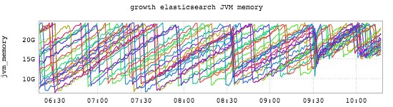
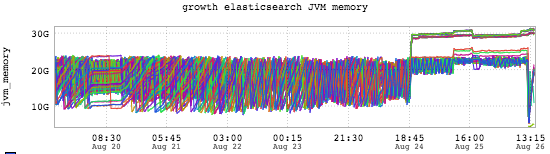

+++
title = "Patterns (The Tighten Up)"
date = "2016-09-01"
slug = "patterns-the-tighten-up"
draft = false
+++

[We don't only sing, we dance just as good as we want](https://open.spotify.com/track/0qKCm8yeHoRJTpryDDQ9TT) (apologies to Archie Bell & the Drells). The Tighten Up is a pattern I see frequently. The specific instance I had in mind was garbage collection - un-collectable heap use increasing due to some event. For instance:

Note the nice long slow regular GC pattern early on, followed by the sudden tighten up. A more drastic example:

I know this one is a bit messy, but just bear with me for a minute. This inGraph paints a picture, it tells a story. Things are moving along nicely and then Something Happens and the old pattern is abandoned. The JVM has maxed out its heap and is struggling to keep itself within the bounds it's been given. Garbage collection is still happening, but heap cannot be reclaimed so the metric tightens into a flatline right around maximum heap.

Note that this pattern is not always bad. This kind of convergence can be desirable, as can be seen _here_. It can **also** be pathologically awful (and lovely all the same) as can be seen [here](/igotw/2016-05-12-the-number-s-of-the-beast/). Context is paramount, but whether good or bad if you see this kind of pattern you probably want to pay attention to what's going on.

*[BTW - Matt Knecht* *Please post your sick-ass OBHC convergence graph in the comments. I wanted to include it in this post but I couldn't find the* *snapshot I took of it.]*

