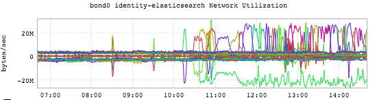
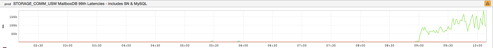
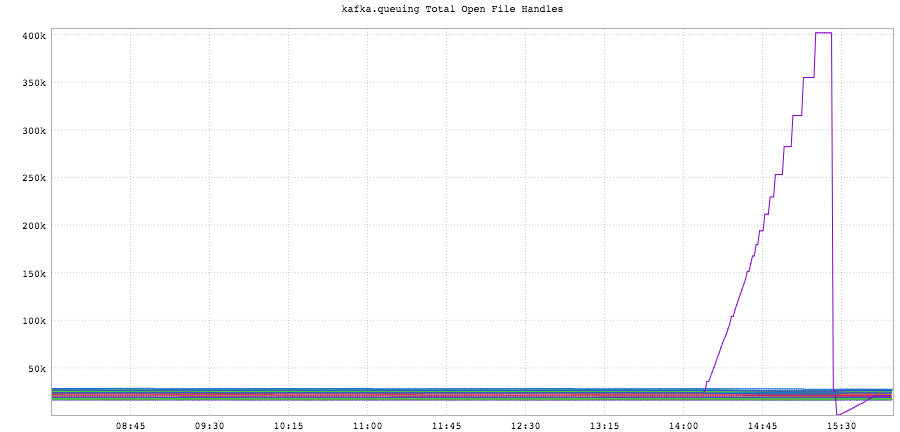
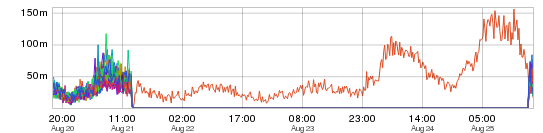

+++
title = "Patterns (The Loner)"
date = "2016-09-08"
slug = "patterns-the-loner"
draft = false
+++

This post will contain some inGraphs that I've posted previously, mostly because I am lazy but at least partly because some of them can illustrate an interesting new facet I'd like to talk about. Let's take a peek:

IIRC _Rylee Fowler_ sent me this one a while back. It's been long enough that I don't recall the specific circumstances, but I **think** what was going on is that an elasticsearch node was being removed from rotation and distributing all of its indices to other nodes. (Note the singleton outbound metric - the green squiggly along the bottom - mirrors the multicolored inbound squigglies along the top.) If I'm not misremembering this one, it was actually expected behavior.

Another example:

It's a little hard to see what's going on here but this is a single espresso storage node's latency going off the charts, so to speak. Along similar lines:

A kafka broker losing its mind wrt open file descriptors. And one of my favorites:

A single node that decided to reconnect to its database after some database maintenance. (The rest of the nodes decided "Nah. I don't wanna.")

This particular pattern of one node being a Special Snowflake is not necessarily always bad. In fact, sometimes it's Expected Behavior. ...but in every case I can think of it's something you'll want to pay attention to.
