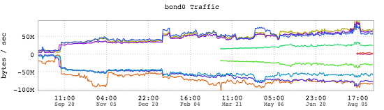
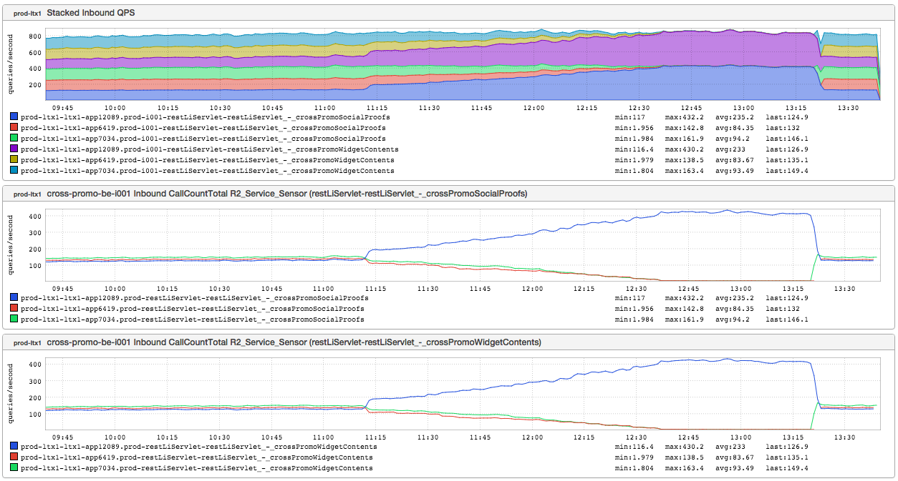
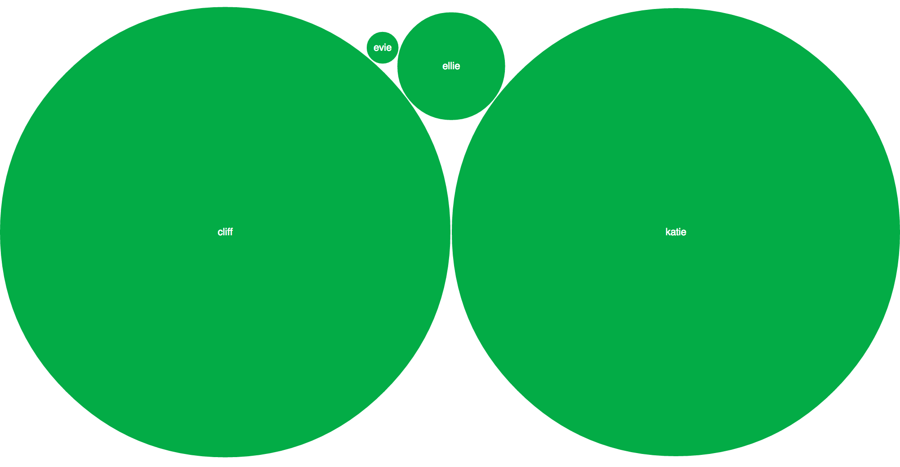

+++
title = "Unintentional Art (Symmetry)"
date = "2016-09-15"
slug = "unintentional-art-symmetry"
draft = false
+++

After two pattern posts in a row I thought maybe we could take a look at some wonderfully-symmetrical inGraphs. A super-common example:

The bytes come in, the bytes go out. Bonus: It looks a bit like an alligator! Along similar visual lines:

[This one may look familiar to regular readers and is intentionally designed to look symmetrical under "normal" circumstances. Also similar:](/igotw/2016-04-07-reverse-polish-notation/)

This is a series of graphs that show a redline test in action. As more and more traffic gets directed to the target node it drops off proportionally on the other nodes; a three-for-one sale of lovely load testing machinery in motion. Finally, something a little different:

Decidedly not an inGraph, this is a little something I slapped together a while back to visualize the age (in months) of my wife and I as compared to our kids. Kate is a few months younger than I am...but you wouldn't necessarily know it by looking at the visual symmetry of our respective Big Green Bubbles.

