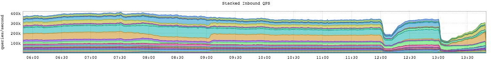

+++
title = "The 38th Inning Stretch"
date = "2016-09-22"
slug = "the-38th-inning-stretch"
draft = false
+++

According to [whatweekisit](https://whatweekisit.com/) it's the 38th week of the year...which has nothing to do with anything, but I'm selecting that as my arbitrary reason to give you a graph without any commentary at all. A hint: it's related to a Major GCN from this week.

There are related inGraphs which I can share upon request; hit me up if you wanna see 'em.
