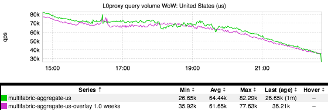
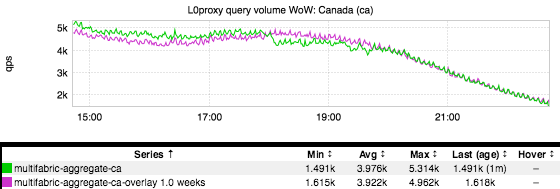

+++
title = "Presidential Debate"
date = "2016-09-29"
slug = "presidential-debate"
draft = false
+++

_Brian Sherwin_ passed along a most excellent idea to me earlier today: ask folks how much they think tonight's presidential debate would impact site traffic. ...so that's exactly what I'm doing. What do you think site traffic might have looked like during the debate? The Big Reveal will be on Thursday, same as always. (Note: Feel free to speak up in the comments and/or DMs on slack/email, but if you happen to know where to look to find the answer then please

don't spoil the fun. )

**Update:** The Big Reveal: It looks like the impact - in terms of US and Canada site traffic (as seen at L0) was something on the order of 10%.

The super-interesting thing to me here: US site traffic actually recovers after about a half hour or so, whereas Canadian traffic stays sort of consistently low through the end of the "debate". At first I was inclined to think "Wow...so Canadians 'care' more about what's going on than Americans do", but I don't think that's quite correct. What I think may be a more accurate interpretation: Americans tuned in for the initial 30 minutes and then started blowing up social media - including LinkedIn - with their opinions about it. Notice how US site traffic not only recovers, but actually starts out-performing the previous week.

Also note the sharp, temporary drop and rebound in the US right around the end of the debate. I interpret this in the form of a User Story: "The debate ended and I got up to go pee...and then I jumped right back into social media to continue the comment feud with my idiot brother-in-law who supports <insert candidate>."
