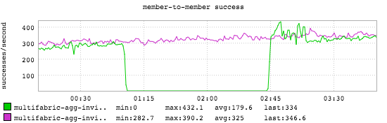
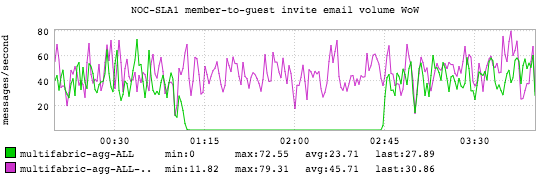
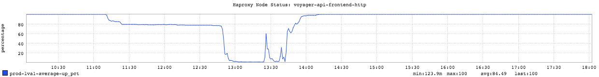
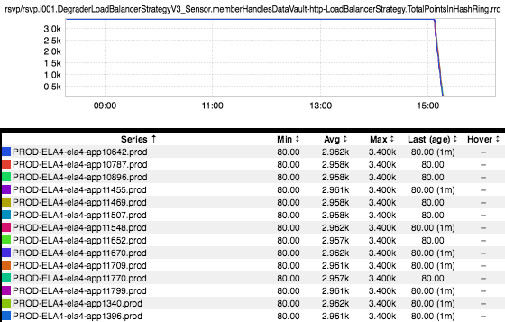
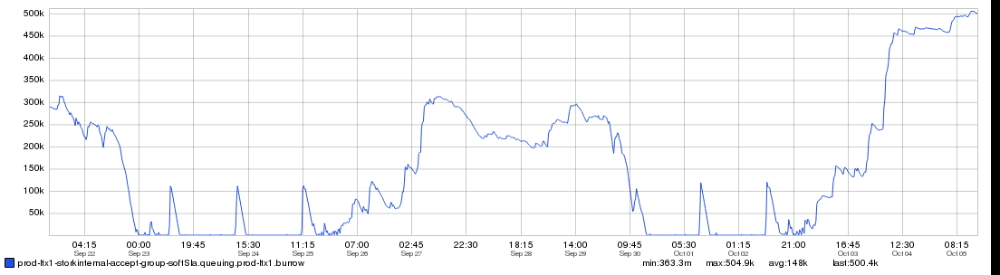

+++
title = "Patterns (The Trough)"
date = "2016-10-06"
slug = "patterns-the-trough"
draft = false
+++

_Flip The Plateau over and you have The Trough. Sometimes it's expected behavior, as in the case of a traffic shift out of a particular fabric; I'll leave finding _ an example of that up to the reader, since it happens almost daily. ...but sometimes your metrics will "bottom out" in ways that you don't particularly like. Perhaps a transactional email flow you care about was humming along just fine and then dropped to the floor:

...or maybe you had a bunch of nodes doing work that just up and fell off the map so far as L1 is concerned:

Similarly in the world of backends maybe your r2 client had hashring points for days that just up and went away:

I know this is only a sort of "half-trough", but I can assure you that it came out okay on the other side. (Also, unless you understand a bit about how r2 works this may be a bit abstract; hit me up if you're interested.)

Or maybe you've got some throttling/rate-limiting that is making queues back up and only fully drain during off-peak times (which is to say "weekends"):

As with most of these sorts of patterns, The Trough may or may not indicate that something is broken...but it's almost certainly something you'll want to look into if you happen to see it.

