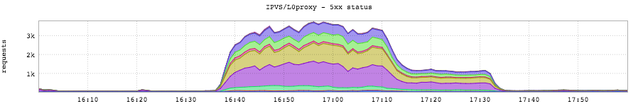
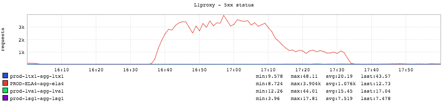
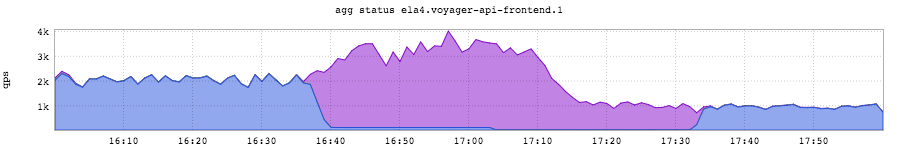
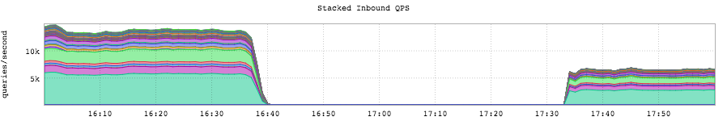
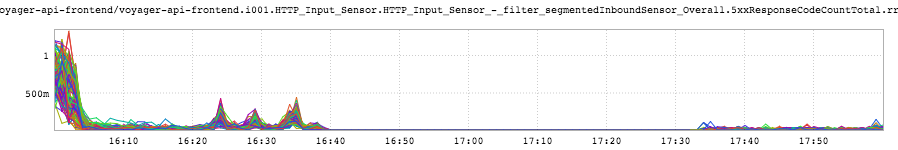

+++
title = "This Is Fine"
date = "2016-10-14"
slug = "this-is-fine"
draft = false
+++

Earlier this week there was a [Major GCN](https://jira01.corp.linkedin.com:8443/browse/GCN-21951). The root cause was a configuration change that behaved in a way other than what was expected, and the impact was that Voyager was hard down in one fabric for about an hour. When bad things happen to the site it generally results in a whole mess of interesting inGraphs, and this time was no exception. First up, let's take a look at l0's view of the world during the timeframe of the GCN:

Man oh man, look at all those 5XXs. Similarly, l1:

...and l1's metrics for voyager as an origin, specifically:

(The blue is 2XX responses, the purple is 5XX responses). Here's what things looked like from the perspective of voyager itself:

QPS just plain bottomed out. "But Cliff," you ask, "doesn't this look pretty much exactly the same as if we'd simply shifted traffic out of that fabric? How does this actually tell us anything is wrong?" Excellent question! It doesn't. So let's see if we can't dig up a voyager inGraph that shows us the 5XXs that voyager tells us it is returning in the logs (e.g., **2016/10/13 00:06:34.641 [warn] [c.l.p.c.f.RequestRejectingInterceptor] [application-akka.actor.default-** **dispatcher-10] [voyager-api-frontend] [] Returning 503 due to: Global limit**).

Now you're saying "Wait...what? That's not what I'd have expected at all!" Yeah. Me neither. I can theorize about a reasonable explanation - e.g., the RequestRejectingInterceptor comes before metric emission in the filter chain - but irrespective of the cause this is pretty scary. A sort of corollary to "you

can't fix what you can't measure" is "*you can't alert on what you can't measure*". But maybe I'm overreacting...I'm sure [things are going to be okay. ](http://gunshowcomic.com/648)
