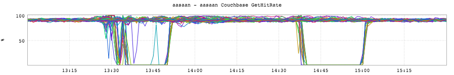
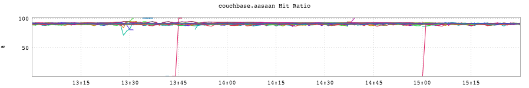
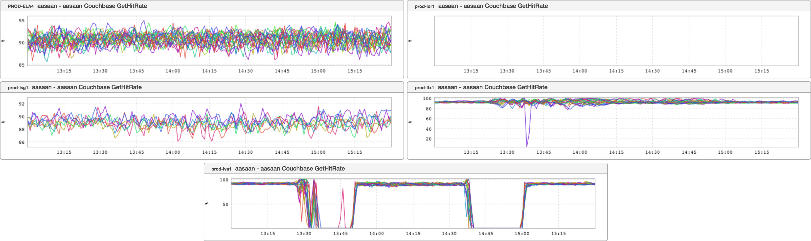
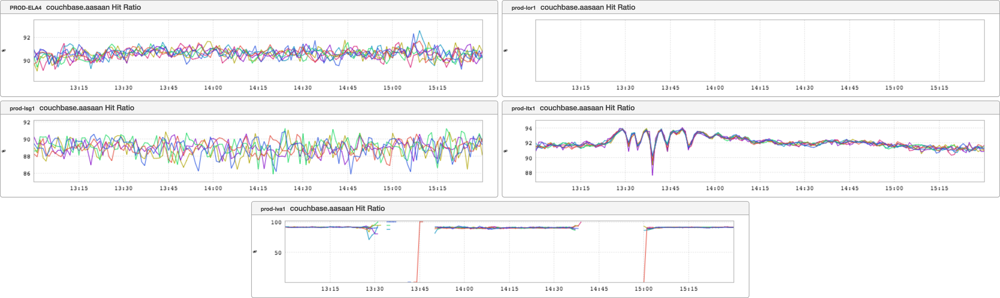

+++
title = "Before You Panic (Split Fabrics)"
date = "2016-10-20"
slug = "before-you-panic-split-fabrics"
draft = false
+++

*[This is the first of a periodic series of posts meant to address the following brand of question: "I saw something fucked-up in an inGraph. What else should* *I look at before I panic?"]*

Suppose you come across the following pair of inGraphs relating to your cache. The first from the perspective of the client:

...and the second from the perspective of the cache itself:

Okay, so there are a couple of points of inflection that sorta-kinda align, but the client thinks hit rate has bottomed out and the cache doesn't seem to think the same thing...right? Well, like the savvy engineer you are you take a look at whether or not there were traffic shifts in those two timeframes (foreshadowing: subject for a future BYP post!) and, sure enough, there were. So what's going on here? Well, let's shed a little light on it using the "Split Fabrics" feature. The button is at the top of the UI and looks like the following:

Alternately, you can just add an &split_fabrics to the URL. Here's what that looks like, once again from the perspective of the client:

...and from the perspective of the cache itself:

Ah, now things seem a little more clear. Traffic was shifted out of lva1. In that fabric, hit rates on the client side bottomed out at zero and hit rates on the cache side disappeared altogether. (If you're interested in why one metric went to zero and one disappeared entirely hit me up. tl;dr: implementation details.) There wasn't any traffic in that fabric, so there were no cache queries to actually hit on.

The Lesson: Know what you're looking at. Before you panic, it may be helpful to split out your metrics by fabric and see if that brings things into focus.
