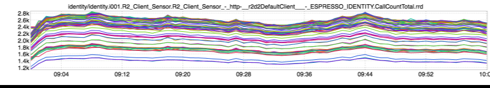
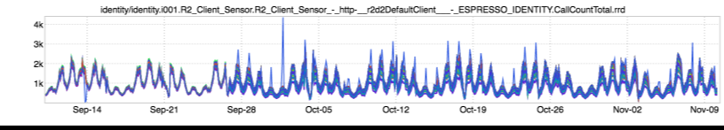
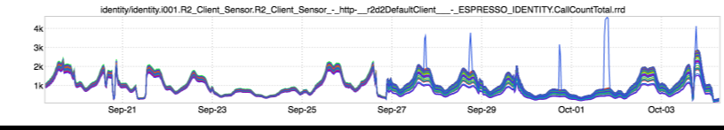

+++
title = "Load (Un)Balancing"
date = "2016-11-10"
slug = "load-un-balancing"
draft = false
+++

I stumbled across some rad inGraphs recently by accident that I thought might be interesting to share. Yay, serendipity! I know I've posted _something _ _similar before, but let's take a look:_

This is traffic from identity (which I'll generically refer to as ISB) to Espresso. It more or less maps directly to inbound QPS. I only chose this particular graph because ISB exposes multiple endpoints and there's no good way to show total per-host QPS for all endpoints. Note the spread. The "top-most" node is taking something like 2800 QPS at peak, and the "bottom-most" node is taking something like 1500 QPS. Consistently.

This is problematic. If the load isn't evenly-distributed among hosts then we've introduced artificial scaling limitations; the bottom-most nodes **could** be doing more work - damn near twice as much - but they aren't being given that opportunity by virtue of how d2 clients are routing traffic.

So...has this always been the case? Well, let's take a look:

Hmmm...it was "tighter" before September. Let's zoom in a bit on the point of inflection:

Look at how the spread was relatively tight before 9/27 and then loosened up.

I asked around about this and as it turns out there were d2 degrader changes put in place in that timeframe to enable _D2 Slow Start. As a part of those _ changes a new consistent hash algorithm was introduced (for reasons I'm not entirely clear on) called [multi-probe](https://arxiv.org/pdf/1505.00062.pdf). For those not interested in reading a pretty technical whitepaper the tl;dr is that multi-probe provides a "knob" for improving load distribution, with the tradeoff being increased memory cost and assignment time.

I'm not sure how (or whether) we've exposed that knob, but I think maybe it could use a little tweaking. (Help me, Obi Wan _David Hoa_!)
