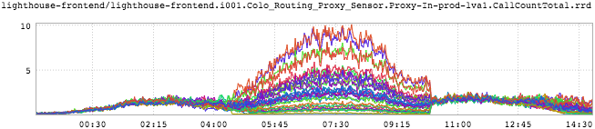

+++
title = "Happy Thanksgiving!"
date = "2016-11-24"
slug = "happy-thanksgiving"
draft = false
+++

I scoured through my pile of inGraphs snapshots for one that looked like a turkey. Sadly, I did not find one. (My wife helpfully asked whether I had one that [looks like mashed potatoes.) Instead, I've got one that I think looks a little like a dimetrodon](https://en.wikipedia.org/wiki/Dimetrodon):

...which I think paleontologists likely agree was the turkey of the dinosaur world.

Happy Thanksgiving, folks.
