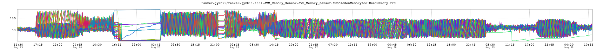

+++
title = "Unintentional Art"
date = "2016-12-01"
slug = "unintentional-art"
draft = false
+++

Thin post this week...but it looks enough like a space ship or an absurdly-long sci-fi laser rifle that I hope you'll forgive me.

[I'm certain that this inGraph tells an interesting story. It actually makes me think a bit of Tufte and the ](https://en.wikipedia.org/wiki/Edward_Tufte)[statistical graphic of Napoleon's march that he seems ](https://www.edwardtufte.com/tufte/posters) to be enamored with. I'd love to tell that story...but sadly, I don't actually know what it is or why I took this screenshot to begin with. So. It's a spaceship.

Happy Thursday!
