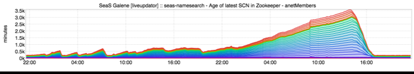
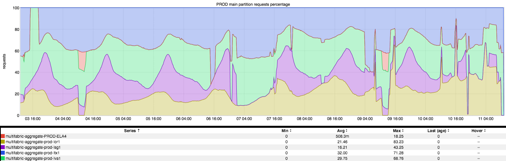

+++
title = "Stacked Graphs"
date = "2016-12-08"
slug = "stacked-graphs"
draft = false
+++

Generally speaking I'm not a fan of the stacked graph. It has limited utility and more often than not has a tendency to distort perception rather than enhance understanding. (PSA: If anyone out there is currently relying on stacked graphs of latency, please reach out to me. You are not alone in this world. I can help.)

That said, there are times when I can appreciate a stacked graph.

_Sometimes they're beautiful, like this SCN age inGraph that James Luck_ sent my way recently:

Sometimes they look like a bit like sand art, as in this inGraph of site traffic distribution (provided by _Michael Kehoe__ and Brian Sherwin_, damn near simultaneously):

...and sometimes they may just look like something else recognizable:

_What I love most about this inGraph is the conversation it prompted with Kathleen Shannon (who provided this graph):_

Me: Hey, cool graph! That gap there looks like kinda like Ohio! I'm from Ohio!

_Kathleen Shannon: <paraphrasing> Fuck you, Ohio is basically the shape of a square, so of course anything that's square-shaped looks like Ohio!_

Fair enough, Katie. Fair enough.
