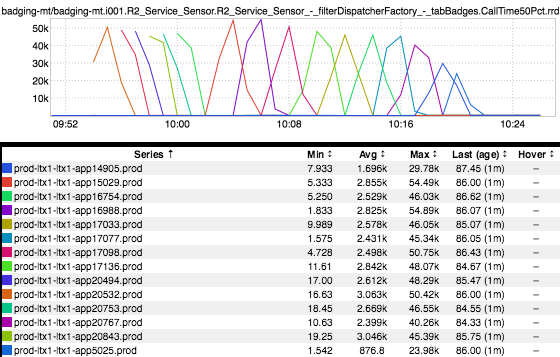

+++
title = "(Un)Graceful Restart?"
date = "2016-12-15"
slug = "un-graceful-restart"
draft = false
+++

I've been thinking about this inGraph a bit today:

This shows the median latency of badging-mt over the course of a restart. On its face, it looks pretty bad - "OMG, when we restart each individual node's p50 goes close to a minute!"

...but I wonder whether that's actually accurate in terms of actual member impact. I'd like to outline a couple of possibilities (not an exhaustive list):

1. The service does not remove itself from d2 as it's shutting down and/or announces to d2 as it's coming up before it's ready to take traffic. This is the worst-case scenario. The service isn't in a good state for handling traffic - whether because it's shutting down or starting up - and that causes latencies to go nuts as it tries to "find itself".

2. The service   properly announcing/de-announcing and the metrics we see are an artifact of incoming traffic draining off. For example, suppose **is** during the drain-off period there is a single long-running request that takes a minute to complete. You now have a single data point...and that data point looks really, really bad.

I think the truth lies somewhere in the middle. Generally speaking, the lower the traffic to a service the less valuable aggregate metrics are (whether that's p50, p95, etc.), so I think it's likely that "the metrics go nuts during restart" is to be expected. **However**, I also have some pretty strong suspicions that we're not as "graceful" about restarts as we assume we are.
