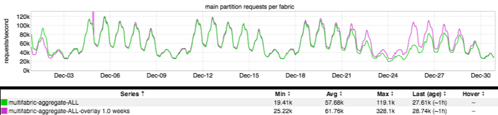
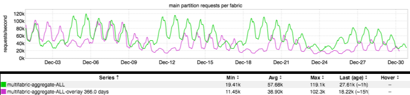

+++
title = "Happy New Year!"
date = "2017-01-05"
slug = "happy-new-year"
draft = false
+++

Today we'll be taking a look at some inGraphs that _Michael Kehoe_ passed along. These inGraphs show incoming site traffic for the month of December. The first one should be pretty familiar - current week with week-over-week overlay:

It should come as no surprise that overall site traffic shows a decline as compared to WoW for the holiday weekend. ...but how does it compare to last year? Well, we can look at year-over-year in inGraphs, too:

There are a couple of interesting things about this inGraph. First of all, overall site traffic is up YoY. Yay! This is one inGraph that we actually **want** to continue to go _up-and-to-the-right_, for the most part. Also, the YoY is shifted by a day. "But Cliff," the astute reader points out, "Christmas was on a Friday in 2015, and on a Sunday in 2016. Why isn't YoY shifted by **two** days?" Well, I'd need someone from sre-infra to confirm, but I assume that inGraphs is taking a naive approach and subtracting 365 days to compute YoY...which works most of the time, but isn't quite correct when looking at dates in December of a leap year. This is easy enough to correct; we can just set the overlay to 366 days:

Hmmm...now this is even **more** interesting. In both of these YoY inGraphs the daily peaks/troughs start off being reasonably well-aligned but then start to sort of "drift". Toward the middle/end of the month they're actually inverted! (I also tried this with 8784 hours and 527040 minutes; same result.) The drift is more pronounced in the 366-day comparison, but it's present in both. Outside of a potential inGraphs overlay bug I do not have a good explanation for

this...but I'll ask around and give an update when I sort it. If you happen to know what's going on here let me know in the comments!
