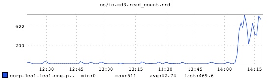

+++
title = "The Thundering Herd"
date = "2017-01-12"
slug = "the-thundering-herd"
draft = false
+++

This week's igotw is a fun little anecdote I'd forgotten about until browsing through my cache of saved-off inGraphs. Most folks reading this are probably [aware of the thundering herd problem - a process/service wakes/starts up and all of the clients who have been waiting on it subsequently beat it to death. ](https://en.wikipedia.org/wiki/Thundering_herd_problem) Well, this is a sort of meat-space example of that. On occasion (read: all the damn time) some poor engineer will wander into a slack channel and let folks know "Hey, I'm trying to do something on eng-portal but it's telling me it's out of disk space, can someone please help me?" Sometimes this happens in #sre...and SREs, being a helpful lot, want to Get to the Bottom of It. Well, here's what it looks like when 50 SREs log into eng-portal and run a du | sort to figure out who's using up all the disk space:

Hilarity ensues.
