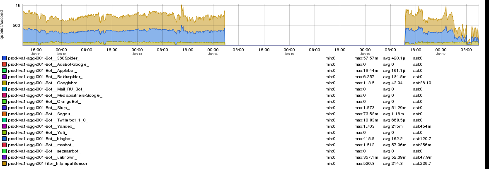
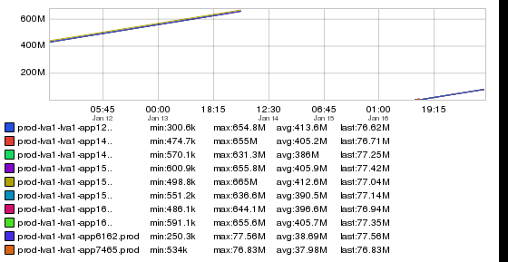
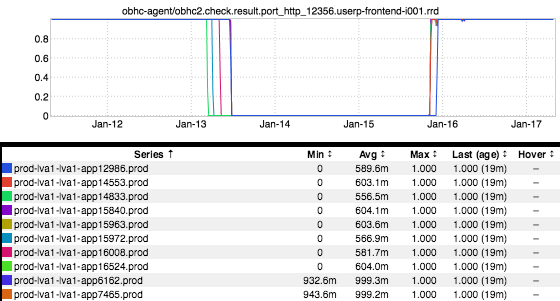
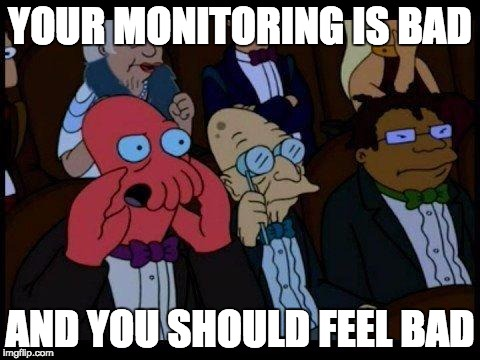

+++
title = "A Cautionary Tale"
date = "2017-01-19"
slug = "a-cautionary-tale"
draft = false
+++

Ever wondered what it might look like if your service went down in a fabric for two days (and nobody noticed)? Well, friend, have I got some inGraphs for you!

There's the QPS graph. Note how it goes to zero...on account of no userp instances being available to receive traffic (and thereby emit metrics). Another:

There's the uptime graph. The corresponding OBHC graph:

Well, shit.

\

There should absolutely have been some kind of alert here - especially for a service that is pretty much wholly SEO-specific (read: bot-facing, not member- facing). No member is going to report this, j-dubs isn't going to send an email if it's down...none of that. No alert = no signal, from GCO or anyone. We're going to shore up that gap. But *why* did it happen?

Well, there's a little context necessary for understanding that:

1. userp-frontend is a service that is currently on _RAIN - LinkedIn's in-house mechanism for dynamic resource allocation._

2. RAIN leverages cgroups in order to protect services that are co-located on a given host from Bad Actors/resource hogs (specific to this case, the resource in question is the amount of memory it's using).

3. The mechanism that cgroups uses for handling services that are trying to go outside of the memory limitations is to kill it. With extreme prejudice.

4. The JVM provides command-line options for the amount of heap to allocate, but that does  **not** equate to the total amount of memory that the process will actually require. There is overhead, and it can take many forms.

Long story short here: that "overhead" increased unexpectedly, causing the oom-killer to kick in and knock down this service in one fabric. (I'm happy to talk about why this fabric, why this service - hit me up directly if you're curious.) platform-sre is engaged and we're working on figuring out exactly what _changed/how to mitigate (thanks Ramadass Venkadasamy_ for being awesome and driving the investigation!). In the meantime, if you're on RAIN you might want to take a close look at how much overall RAM your service is actually consuming and whether that puts your service in danger of a similar situation.

