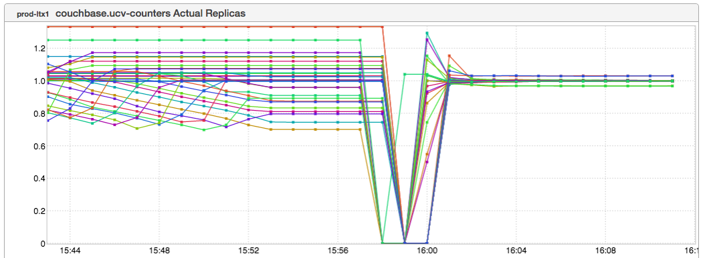

+++
title = "Dotted Line!"
date = "2017-01-26"
slug = "dotted-line"
draft = false
+++

_This week's igotw comes courtesy of Jerilyn Franz._

The metric is Couchbase "Actual Replicas". What that means: Couchbase can be configured to maintain zero or more replicas of data. This can be super- useful if you want to be able to take a node out of rotation and not lose access to data while it's OOR. This particular cluster is apparently configured to hold one replica. For reasons I don't entirely understand - I am **far** from being a Couchbase expert - sometimes replicas can become unevenly distributed. This is undesirable. If you say "I'd like one replica" then you generally want the number of Actual Replicas to converge at one; otherwise if you lose a node with a disproportionate distribution of replica data then you may be in danger of temporarily losing access to data. (I have seen this firsthand, but if someone can explain to me **how** things can get into this state and why there isn't automatic recovery over time I'd love to understand it better.)

In Jeri's own words: "First repair was simply trying to rebalance it after failing out the problem nodes. Second repair was deleting the bucket and recreating it." If the former bit isn't obvious, I think the latter is (in the form of the big fuckall dip, recovery, and convergence around 1 actual replica).

While I don't actually have the full story around this inGraph, I like it for a few reasons:

1. It definitely tells a story. Maybe I don't fully understand the story...but it's there, and it's interesting.

2. It's the first effective use of the "Dotted Line" inGraph that I've actually seen.

3. It's gorgeous. I mean, just look at it!

Thanks, Jeri!
