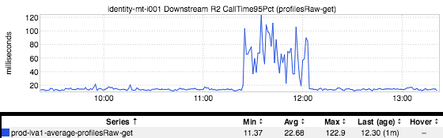
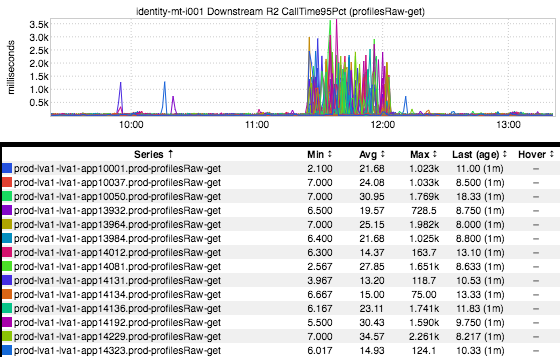
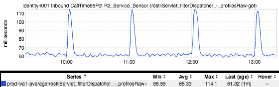
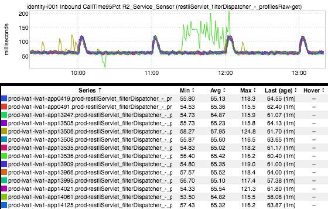

+++
title = "Before You Panic (Aggregation)"
date = "2017-02-02"
slug = "before-you-panic-aggregation"
draft = false
+++

Suppose you see a spike in your service's latency. It might look something like this:

Well, okay. This inGraph shows the average of a bunch of nodes' 95th percentile latencies. Averaging percentile values makes the Baby Jesus cry, so let's remove that averaging function and take a look at each individual host's latency.

Hmmm...a whole bunch of nodes are seeing that additional latency and it's actually worse than we'd thought wrt magnitude (look at the scale); not terribly surprising when you torture statistics by doing something like averaging per-host 95th percentile values. Where do we go from here? SOP: Take a look at the metrics for the downstream service that's serving that endpoint:

That doesn't look so bad - I mean, there are these weird hourly spikes (I'm happy to explain those - hit me up if you're interested) but they don't really match up with the timing of the upstream's latency woes. ...so what if we de-aggregate this one, too?  (see: the bit about abusing statistics above)

Ah, **there** she is. One lil node out there just wilding out. One lil node that got lost in the noise.

The Lesson: *Know what you're looking at.* Before you panic, it may be helpful to split out your metrics per-host.
